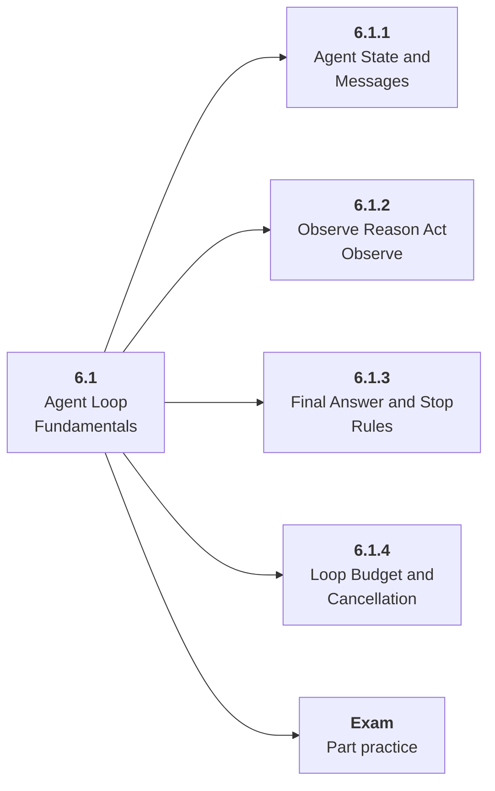

# 6.1 Agent Loop Fundamentals

## Role at Stage 6: AI Agents

Build the observe-think-act-observe-finish loop explicitly before using frameworks. This part is one capability inside the stage. It should leave behind an artifact, measurements, and a short explanation of failure modes.

## Explanation

This part has 4 sub-parts because the topic needs that many learning units to feel natural. Some stages have more parts and some have fewer; the structure follows the topic, not a fixed template.

## Part Diagram

## Sub-Parts

| Sub-part folder | What it explains |
|---|---|
| [6.1.1 Agent State and Messages](<6.1.1 Agent State and Messages/index.md>) | Agent State and Messages is the working skill inside Agent Loop Fundamentals that helps you build the stage artifact, A tool-using agent with typed tools, memory, traces, task evals, prompt-injection tests, and an architecture README, while collecting enough evidence to trust the result. |
| [6.1.2 Observe Reason Act Observe](<6.1.2 Observe Reason Act Observe/index.md>) | Observe Reason Act Observe is the working skill inside Agent Loop Fundamentals that helps you build the stage artifact, A tool-using agent with typed tools, memory, traces, task evals, prompt-injection tests, and an architecture README, while collecting enough evidence to trust the result. |
| [6.1.3 Final Answer and Stop Rules](<6.1.3 Final Answer and Stop Rules/index.md>) | Final Answer and Stop Rules is the working skill inside Agent Loop Fundamentals that helps you build the stage artifact, A tool-using agent with typed tools, memory, traces, task evals, prompt-injection tests, and an architecture README, while collecting enough evidence to trust the result. |
| [6.1.4 Loop Budget and Cancellation](<6.1.4 Loop Budget and Cancellation/index.md>) | Loop Budget and Cancellation is the working skill inside Agent Loop Fundamentals that helps you build the stage artifact, A tool-using agent with typed tools, memory, traces, task evals, prompt-injection tests, and an architecture README, while collecting enough evidence to trust the result. |

## What a Person Who Masters This Part Can Do

- Explain how Agent Loop Fundamentals supports a tool-using agent with typed tools, memory, traces, task evals, prompt-injection tests, and an architecture readme..
- Build and inspect this artifact: Build a manual ReAct-style agent.
- Measure progress with: Track steps, success, invalid actions, and stop reasons.
- Debug at least one failure mode before moving to the next part.

## Build and Measure

**Build:** Build a manual ReAct-style agent.

**Measure:** Track steps, success, invalid actions, and stop reasons.

## Tests

Take one 30-question exam after studying this part. It opens in a new browser tab so the study page stays available.

  <a href="test/exam.html" target="_blank" rel="noopener">Open Part Exam</a>

## Back to Stage

Return to [Stage 6: AI Agents](<../index.md>).
