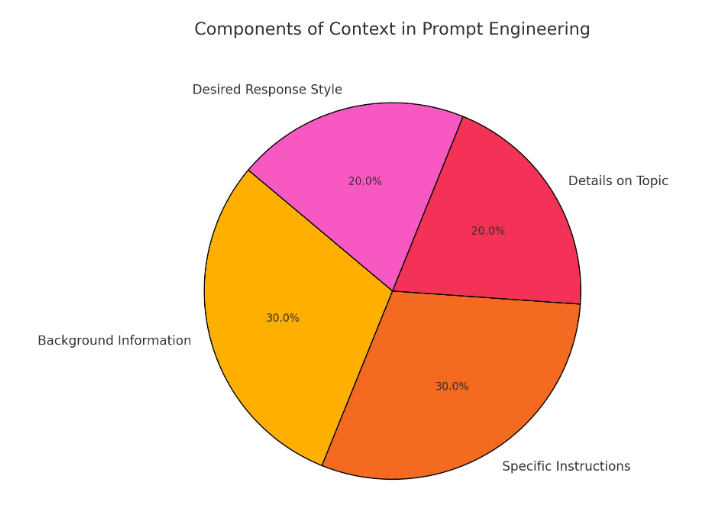
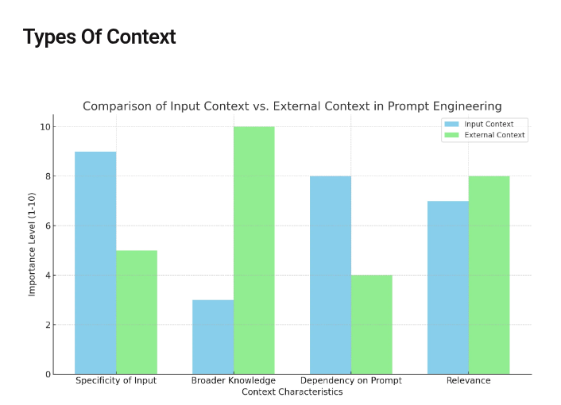
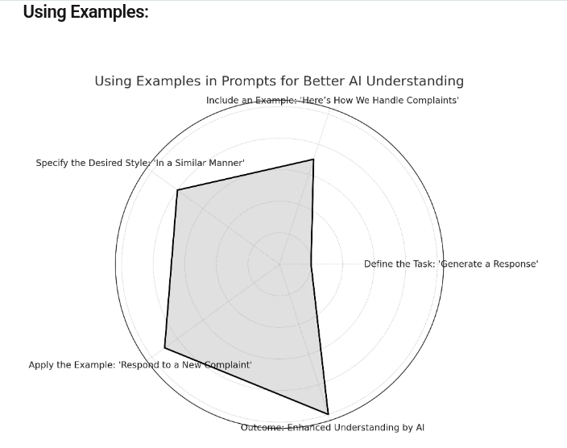
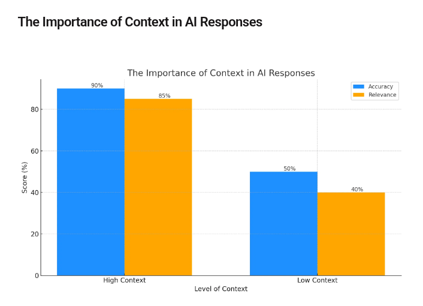

# Provide Additional Context

## Goal

Learn how to add the background information a model needs to answer the right
question, for the right user, in the right format.

Context is not filler. It is the operating environment for the prompt: the
user's situation, the task constraints, the source material, and the rules the
model should respect.



## Learn

Start with the difference between the instruction and the context.

| Prompt part | Role | Example |
|---|---|---|
| Instruction | What the model should do | `Draft a customer reply.` |
| Context | What the model should know | `The customer paid for overnight shipping, but the carrier delayed delivery by two days.` |
| Constraints | What the model must respect | `Do not promise a refund. Offer tracking help and escalation.` |
| Output format | How the answer should look | `Use three short paragraphs and a subject line.` |

Useful context can include:

- user state
- retrieved documents
- tool results
- product rules
- trusted instructions versus untrusted evidence
- the target audience
- prior conversation turns
- examples of the desired output

The reference article frames context as background information that helps a
model understand a request. For roadmap purposes, split context into three
groups:



| Context type | What it means | Prompt engineering use |
|---|---|---|
| Input context | Details you place directly in the prompt | User goal, audience, tone, facts, constraints, examples |
| Conversation context | Prior messages and decisions in the current exchange | Avoids repetition and preserves continuity |
| External context | Information retrieved or supplied from outside the prompt | Search results, documents, databases, tool outputs |

The model can only use context that fits inside its context window. A larger
window can hold more material, but more material is not automatically better.
The prompt still needs hierarchy: task first, trusted rules next, evidence
after that.

## Context Checklist

Before adding context, ask:

| Question | Why it matters |
|---|---|
| What ambiguity could the model resolve incorrectly? | Prevents broad or off-target answers. |
| Which facts are required to complete the task? | Keeps the prompt focused. |
| Which facts are only supporting evidence? | Helps separate trusted instructions from data. |
| Are any sources untrusted? | Prevents documents or tool output from overriding system rules. |
| What should the model ignore? | Reduces distraction from irrelevant details. |

Good context is specific, relevant, and easy to scan. If the context is long,
use labels:

```text
Task:
Summarize the support issue and suggest the next action.

User state:
- Plan: Pro
- Region: EU
- Last payment: successful

Trusted policy:
- Do not offer account credits without manager approval.
- Escalate billing disputes over $500.

Customer message:
"I was charged twice and need this fixed today."
```

## Context Patterns

Use the smallest pattern that makes the task unambiguous.

### Scene Setting

Use scene setting when the model needs to know who the answer is for and what
the situation is.

```text
You are helping a first-time founder prepare a 6-slide investor update.
The audience is existing seed investors. The company missed its revenue target
but improved retention. Keep the tone accountable, not defensive.
```

### Source-Grounded Context

Use source-grounded context when the answer must be based on evidence.

```text
Answer using only the notes below. If the notes do not contain the answer,
say what is missing.

Notes:
- The customer upgraded on May 12.
- The duplicate invoice was issued on May 13.
- Billing has not verified whether the second charge settled.
```

### Policy Context

Use policy context when the model must follow business, safety, or product
rules.

```text
Policy:
- Do not promise refunds before billing verification.
- Escalate duplicate charges within one business day.
- Ask for the invoice number if it is missing.
```

### Example Context

Use examples when the model needs to match a style, structure, or decision
pattern.



```text
Example style:
"Thanks for flagging this. I can see why this is frustrating. I will check the
invoice trail and escalate this to billing if the duplicate charge appears in
our payment processor."

Now write a reply for the new customer message.
```

## Context Quality



Strong context improves relevance and accuracy, but overloaded context can hurt
focus. Treat context like a budget:

| Context amount | Typical output | Fix |
|---|---|---|
| Too little | Generic, vague, or asks avoidable follow-up questions | Add the missing facts, audience, and constraints |
| Targeted | Specific, policy-aware, and easier to verify | Keep the structure and remove unused details |
| Too much | Wanders, mixes priorities, or follows irrelevant details | Summarize, label, or split the task |

## Build

Create two prompts for the same task.

### Prompt A: No Context

```text
Write a response to a customer who has a billing problem.
```

### Prompt B: Relevant Context

```text
Task:
Write a support response.

Customer context:
- The customer is on the Pro plan.
- They were charged twice for the same invoice.
- They are asking for help today.

Policy context:
- Apologize for the inconvenience.
- Do not promise a refund until billing verifies the duplicate charge.
- Offer to escalate to billing and ask for the invoice number.

Output:
- 120 words or fewer.
- Calm, direct, and professional.
```

Compare the answers and identify:

- which answer is more specific
- which answer follows policy better
- which answer asks for the right missing information
- whether any context was unnecessary

Then repeat the exercise in one of these domains:

| Domain | Low-context prompt | Add context about |
|---|---|---|
| Healthcare triage | `What could cause a cough?` | age range, duration, risk factors, red flags, limits of advice |
| Customer service | `Help with my order.` | order status, delay reason, policy, next action |
| Content creation | `Write a social post.` | audience, product, goal, channel, tone |

For high-stakes domains such as health, law, finance, or safety, context does
not make the model authoritative. It only helps the model ask better questions,
state uncertainty, and route the user toward the right expert or process.

## Measure

A context-rich prompt is working when the output:

- answers the intended question instead of a generic version of the question
- uses the supplied facts correctly
- does not invent missing facts
- follows trusted rules over untrusted source text
- stays focused despite extra information
- uses previous conversation state without repeating old work
- asks for missing critical details instead of guessing

## Exit Criteria

You can add context without burying the main instruction, and you can explain
why each piece of context is included.

## Common Mistake

Do not paste everything you know into the prompt. Long context can dilute the
task, distract the model, or push important instructions out of the usable
context window. Prefer the smallest set of facts, rules, examples, and evidence
needed for the current answer.

Other common mistakes:

| Mistake | Why it fails | Better move |
|---|---|---|
| Adding facts without labels | The model may mix rules, evidence, and user text | Use headings such as `Task`, `Policy`, `Evidence`, and `Output` |
| Treating retrieved text as instruction | Untrusted documents can conflict with system or product rules | Tell the model the text is evidence, not authority |
| Ignoring prior turns | The answer may repeat, contradict, or lose the thread | Summarize the current state before asking the next task |
| Optimizing only for detail | The model may produce long but unfocused output | Define the success condition and format |

## Next

Move to examples after you can provide context cleanly. Examples show the model
the pattern of answer you want, while context gives it the facts and constraints
needed for this specific task.

## Resource

- [What is Context in Prompt Engineering? Here's Everything You Need To Know](https://godofprompt.ai/blog/what-is-context-in-prompt-engineering/)
