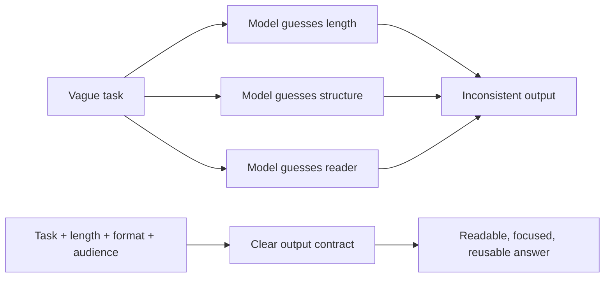

# Specify Length, Format, and Audience

## Purpose

Length, format, and audience constraints turn a vague request into an output
contract. They tell the model how much to write, what shape the answer must
take, and who the answer is for.

Use these constraints when the response must be easy to read, compare, copy,
evaluate, or parse by software.

## Core Idea

A prompt should answer three output questions before the model starts writing:

| Constraint | Question it answers | Example instruction |
| --- | --- | --- |
| Length | How much detail is needed? | `Write about 120 words.` |
| Format | What structure should the answer follow? | `Return a markdown table with columns: Risk, Cause, Mitigation.` |
| Audience | Who needs to understand or use this? | `Write for a non-technical product manager.` |

If you omit these details, the model must guess. Guessing often produces
answers that are too long, too shallow, too technical, too casual, or difficult
to reuse.

## Make Constraints Testable

A constraint is specific when another person or program can check whether the
answer followed it.

| Vague instruction | Specific instruction | How to check it |
| --- | --- | --- |
| `Make it short.` | `Use exactly 5 bullets, each under 14 words.` | Count bullets and words |
| `Use a table.` | `Use columns: Term, Meaning, Example, Common mistake.` | Check column names and order |
| `Write for beginners.` | `Assume no Python or ML background; define every technical term once.` | Scan vocabulary and definitions |
| `Give JSON.` | `Return only valid JSON with keys: title, summary, risks.` | Parse JSON and check keys |
| `Be professional.` | `Use a neutral business tone; avoid jokes, slang, and emojis.` | Review tone rules |

Put these rules near the start or in a clearly labeled `Output requirements`
section. If the task is long, repeat the required output format immediately
before the model should answer.

## Why This Works

Models are good at matching patterns. A clear output contract gives the model a
pattern to follow and reduces ambiguity.



## Specify Length

Length controls depth. A short answer is useful when the reader needs a quick
decision. A long answer is useful when the task needs explanation, evidence,
tradeoffs, or examples.

| Length instruction | Best for | Prompt example |
| --- | --- | --- |
| `One sentence` | Definitions, labels, quick checks | `Explain vector databases in one sentence.` |
| `3-5 bullets` | Scannable summaries | `Summarize the risks in 5 bullets.` |
| `About 100 words` | Short explanations | `Explain retrieval augmented generation in about 100 words.` |
| `300-500 words` | Brief articles or decision notes | `Write a 400-word overview for engineering managers.` |
| `Step-by-step` | Procedures, tutorials, debugging | `Explain how to deploy the model in 7 numbered steps.` |
| `No more than 2 pages` | Reports, memos, design notes | `Create a concise design memo, no more than 2 pages.` |

Prefer practical limits over vague phrases:

| Weak | Better |
| --- | --- |
| `Keep it short.` | `Use 5 bullets, max 12 words each.` |
| `Explain in detail.` | `Write 600-800 words with examples and tradeoffs.` |
| `Make it concise.` | `Use one paragraph under 90 words.` |

Length does not need to be exact for every task. For human reading, approximate
limits are usually enough. For UI copy, social posts, database fields, or
automation, use stricter limits.

### Prompt Length Categories

Prompt length is different from output length. Prompt length means how much
instruction you give the model. Output length means how much the model should
write back. Both matter.

| Prompt length | Best for | Use when | Example prompt |
| --- | --- | --- | --- |
| Short prompt, `1-10 words` | Quick answers | The task is simple and the expected answer is obvious | `Define prompt engineering.` |
| Medium prompt, `11-50 words` | Guided explanations | The task needs context, comparison, or a specific structure | `Compare short and long prompts in prompt engineering. Give examples of when each is useful.` |
| Long prompt, `51+ words` | Complex tasks | The task needs role, audience, constraints, examples, format, and success criteria | `You are a prompt engineering tutor. Write a beginner-friendly 1000-word guide covering key concepts, best practices, common mistakes, examples, and one short case study.` |

Short prompts are efficient, but they leave more room for guessing. Use them for
definitions, quick facts, simple transformations, and yes/no questions.

Medium prompts are the default for most learning and work tasks. They give the
model enough context to choose the right depth, structure, and examples without
becoming overloaded.

Long prompts are useful when the answer must satisfy many requirements. Use them
for in-depth analysis, creative writing, multi-step problem solving, code tasks,
agent workflows, and content that needs a precise audience or format.

| Prompt type | Good example | Why it works |
| --- | --- | --- |
| Short | `Define embeddings.` | The task is narrow and needs no extra context |
| Medium | `Explain embeddings to a beginner in 5 bullets with one analogy.` | Adds audience, length, format, and style |
| Long | `You are teaching junior developers. Explain embeddings in 500 words with sections for definition, intuition, example, common mistake, and when to use them in RAG.` | Gives role, audience, length, structure, topic scope, and use case |

Do not make a prompt long just to sound detailed. Add length only when it gives
the model useful constraints: audience, source material, examples, allowed
actions, forbidden actions, output format, or evaluation criteria.

### Specific Length Rules

Choose the length rule based on where the output will go.

| Output destination | Good length rule | Why |
| --- | --- | --- |
| Button or label | `2-4 words` | Fits UI constraints |
| Tooltip | `One sentence under 20 words` | Readable on hover |
| Executive summary | `3 bullets, max 20 words each` | Easy to scan |
| Study note | `150-250 words with one example` | Enough context without overload |
| Tutorial | `6-10 numbered steps` | Clear sequence |
| JSON field | `String under 120 characters` | Easier validation and storage |

Avoid exact word counts when meaning matters more than precision. Use ranges
such as `180-220 words` or structural limits such as `5 bullets`.

## Specify Format

Format controls how the answer is organized. Use it when the output must be
easy to skim, compare, validate, or pass into another tool.

| Format | Use when | Example instruction |
| --- | --- | --- |
| Bullets | The reader needs quick takeaways | `Use 6 bullets, ordered by importance.` |
| Numbered list | Sequence matters | `Return the setup steps as a numbered list.` |
| Table | The reader must compare options | `Use a table with columns: Option, Cost, Risk, When to use.` |
| Markdown | The answer will become docs or notes | `Use markdown headings and fenced code blocks.` |
| JSON | Software must parse the result | `Return only valid JSON matching this schema.` |
| Email | The output must be sent to a person | `Write as a professional email with subject line.` |
| Checklist | The user must verify completion | `Return a checklist with pass/fail criteria.` |

### Format Recipes

Use a recipe when you need repeatable output.

| Task | Specific format recipe |
| --- | --- |
| Compare options | `Return a markdown table with columns: Option, Best for, Tradeoff, Recommendation.` |
| Explain a concept | `Use sections: Definition, Why it matters, Example, Common mistake.` |
| Summarize a source | `Use 4 bullets: main claim, evidence, limitation, action item.` |
| Write a how-to | `Use numbered steps. Each step must start with a verb.` |
| Extract data | `Return only JSON. No markdown, no comments, no trailing text.` |
| Review output | `Use sections: Findings, Risks, Missing information, Suggested fix.` |

### Human-Readable Format

Use markdown when the output is for people.

```text
Explain prompt injection to junior developers.
Format:
- One-sentence definition
- Three common attack examples
- One markdown table with columns: Attack, Why it works, Mitigation
- End with a 3-item checklist
Length: under 350 words
Audience: junior backend developers
```

### Parser-Safe Format

Use JSON when another program needs the answer. Be strict about keys, types, and
extra text.

```text
Extract the task requirements from the user message.

Return only valid JSON. Do not include markdown.

Schema:
{
  "task": "string",
  "audience": "string",
  "deliverables": ["string"],
  "constraints": ["string"],
  "missing_information": ["string"]
}
```

For production workflows, validate the JSON before trusting it. If validation
fails, retry with the error message or route the output to a human.

### Specific JSON Contract

For software parsing, specify required keys, allowed values, and what to do when
information is missing.

```text
Extract a support ticket from the user message.

Output requirements:
- Return only valid JSON.
- Use exactly these keys: title, priority, category, summary, missing_fields.
- priority must be one of: low, medium, high, urgent.
- category must be one of: billing, bug, account, feature_request, other.
- If a value is unknown, use null and add the field name to missing_fields.
- Do not invent customer IDs, dates, or product names.

JSON shape:
{
  "title": "string",
  "priority": "low | medium | high | urgent",
  "category": "billing | bug | account | feature_request | other",
  "summary": "string under 80 words",
  "missing_fields": ["string"]
}
```

Specific parser checks:

| Check | Pass condition |
| --- | --- |
| Valid JSON | A JSON parser accepts the output |
| No extra prose | The first non-space character is `{` and the last is `}` |
| Required keys | All required keys exist exactly once |
| Allowed values | Enum fields use only allowed values |
| Missing data | Unknown facts are `null`, not invented |

## Specify Audience

Audience controls vocabulary, assumptions, examples, and level of detail. The
same topic should look different for a child, a new developer, a CTO, and a
domain expert.

| Audience | What changes | Example direction |
| --- | --- | --- |
| Beginner | Define terms and avoid jargon | `Assume no prior AI knowledge.` |
| Student | Teach concepts and show examples | `Use simple examples and explain key terms.` |
| Developer | Include implementation details | `Mention APIs, failure modes, and code-level tradeoffs.` |
| Manager | Focus on decisions and risk | `Emphasize business impact, cost, and timeline.` |
| Executive | Be concise and outcome-oriented | `Use an executive summary with recommendations.` |
| Expert | Use precise terms and skip basics | `Assume familiarity with transformers and retrieval systems.` |
| Customer | Keep it practical and reassuring | `Avoid internal jargon and explain benefits clearly.` |

### Same Topic, Different Audience

Topic: `AI agents`

| Audience | Better prompt | Expected style |
| --- | --- | --- |
| High school student | `Explain AI agents to a high school student in 120 words using an everyday analogy.` | Simple, concrete, analogy-driven |
| Junior developer | `Explain AI agents to a junior Python developer in 5 bullets, including tools, memory, and control loops.` | Technical but beginner-friendly |
| CTO | `Summarize AI agent adoption risks for a CTO in a 1-page decision memo.` | Strategic, risk-aware, decision-focused |
| ML researcher | `Compare tool-using LLM agents with classical planning systems for an ML researcher.` | Dense, precise, assumes background knowledge |

### Specific Audience Profile

Instead of writing only `for beginners`, define the reader more precisely.

```text
Audience:
- Role: junior backend developer
- Prior knowledge: knows HTTP APIs and Python basics
- Unknown concepts: vector databases, embeddings, RAG
- Goal: decide what to learn next
- Tone: direct and practical
```

This tells the model which terms need definitions and which terms can be used
without explanation.

## Prompt Blueprint

Think of the final prompt as a small specification.

```text
[Task]
What should the model do?

[Length]
How much should it write?

[Format]
What structure, sections, fields, or ordering should it use?

[Audience]
Who is the answer for, and what can they already understand?

[Quality bar]
What should the answer include, avoid, cite, refuse, or verify?
```

### Illustration: From Vague to Useful

```text
Vague:
Explain cybersecurity.

Better:
Explain cybersecurity to small business owners in about 250 words.
Use markdown with these sections:
1. What it means
2. Common threats
3. Business impact
4. Three practical prevention steps
Avoid technical jargon unless you define it.
```

The better version gives the model a target reader, a length budget, a required
structure, and a style constraint.

## Specific Before and After Examples

### Example 1: Human-Readable Explanation

Weak:

```text
Explain AI agents.
```

Specific:

```text
Explain AI agents to a junior Python developer.

Output requirements:
- Length: 180-220 words.
- Format: markdown with sections: Definition, How the loop works, Example,
  Common mistake.
- Audience: knows APIs and functions, but is new to LLM agents.
- Style: practical, no hype, define "tool" and "observation".
```

### Example 2: Comparison Table

Weak:

```text
Compare RAG and fine-tuning.
```

Specific:

```text
Compare RAG and fine-tuning for a startup CTO deciding what to build first.

Output requirements:
- Use a markdown table only.
- Columns, in this order: Approach, Best when, Data needed, Cost risk,
  Operational risk, Recommendation.
- Keep each cell under 25 words.
- End with one final row named "Default choice".
```

### Example 3: Parser-Safe Extraction

Weak:

```text
Get the action items from this meeting note.
```

Specific:

```text
Extract action items from the meeting note.

Return only valid JSON:
{
  "action_items": [
    {
      "task": "string",
      "owner": "string or null",
      "due_date": "YYYY-MM-DD or null",
      "priority": "low | medium | high"
    }
  ],
  "missing_fields": ["string"]
}

Rules:
- Do not infer a due date unless it is explicitly stated.
- If owner is unclear, use null.
- Preserve the original task meaning in under 20 words.
```

## Combined Example

### Prompt

```text
You are helping a startup founder understand RAG.

Write for a non-technical founder who understands basic SaaS products but not
machine learning.

Length: 180-220 words.

Format:
1. One-sentence definition
2. Markdown table with columns: Benefit, Example, Risk
3. Three-bullet recommendation

Avoid equations and academic terminology.
```

### Why It Is Strong

| Part | What it controls |
| --- | --- |
| `non-technical founder` | Audience, vocabulary, examples |
| `180-220 words` | Depth and time-to-read |
| `definition + table + bullets` | Output structure |
| `Avoid equations...` | Style and exclusion rules |

## Citation, Refusal, and Escalation Formats

Some tasks need more than ordinary formatting. If the output can affect a
decision, tell the model how to cite uncertainty, refuse unsafe work, or
escalate missing information.

```text
Answer in this format:

Summary:
- 3 bullets maximum

Evidence:
- Cite each source with a link
- Mark unsupported claims as "uncertain"

If the request asks for illegal, unsafe, or private information:
- Refuse briefly
- Offer a safe alternative

If required information is missing:
- Ask up to 3 clarifying questions
```

This matters in AI agents because downstream tools may treat the model response
as an instruction. A predictable refusal or escalation format makes the agent
easier to audit.

## Common Mistakes

| Mistake | Result | Fix |
| --- | --- | --- |
| Asking for `a summary` without length | Output may be one sentence or several pages | Specify bullets, words, or sections |
| Asking for JSON plus explanation | Parser may fail on extra text | Say `Return only valid JSON` |
| Choosing a format after the task is complex | Important constraints may be ignored | Put output rules near the start |
| Ignoring audience | Tone and depth may miss the reader | State role, knowledge level, and goal |
| Overloading the prompt | The model may drop requirements | Split complex work into steps or schemas |

## Validation Checklist

Use this checklist before accepting the model response:

| Requirement | Check |
| --- | --- |
| Length | Does the answer meet the word, bullet, row, or field limit? |
| Format | Are sections, columns, keys, or list types exactly as requested? |
| Audience | Is the vocabulary appropriate for the specified reader? |
| Completeness | Does every required section or field contain useful content? |
| No invention | Are missing facts marked as missing instead of guessed? |
| Parser safety | Can structured output be parsed without manual cleanup? |
| Style | Does the answer follow tone and exclusion rules? |

## Practice

Rewrite each weak prompt so it includes length, format, and audience.

| Weak prompt | Add constraints |
| --- | --- |
| `Explain cloud computing.` | Length, format, and audience |
| `Compare Python and Java.` | Table columns and reader level |
| `Write about AI safety.` | Word count, sections, and citation rules |
| `Summarize this article.` | Bullet count, target reader, and action items |

## Build

Create three prompts for the same task:

1. A free-form prompt for a human reader.
2. A schema-constrained prompt for software parsing.
3. A short UI or executive-summary prompt with strict length limits.

Then compare:

- Which output is easier to skim?
- Which output is easier to validate?
- What information was lost or improved by adding a strict format?
- Did the audience instruction change vocabulary and examples?
- Which constraints can be checked automatically?

## Exit Criteria

You can design an output contract that specifies length, format, audience, and
validation rules. You can write testable instructions with exact sections,
columns, keys, allowed values, length limits, missing-data behavior, and audience
assumptions. You can also reject or repair malformed output before it reaches
users or downstream tools.

## Source Notes

This page synthesizes the provided study note and the Techlasi article on
format, length, and audience in prompt engineering:

- [Mastering Prompt Engineering: Format, Length, and Audience Examples](https://techlasi.com/savvy/mastering-prompt-engineering-format-length-and-audience-examples-for-2024/)
