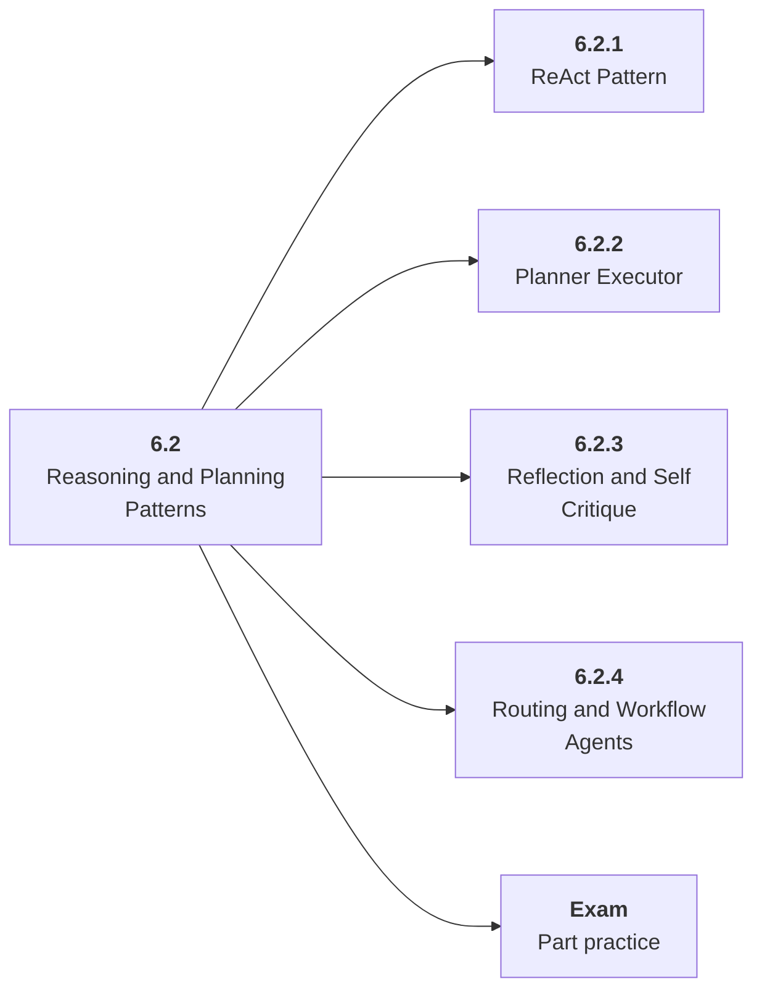

# 6.2 Reasoning and Planning Patterns

## Role at Stage 6: AI Agents

Use planning, decomposition, reflection, and routing only when the task needs them. This part is one capability inside the stage. It should leave behind an artifact, measurements, and a short explanation of failure modes.

## Explanation

This part has 4 sub-parts because the topic needs that many learning units to feel natural. Some stages have more parts and some have fewer; the structure follows the topic, not a fixed template.

## Part Diagram

## Sub-Parts

| Sub-part folder | What it explains |
|---|---|
| [6.2.1 ReAct Pattern](<6.2.1 ReAct Pattern/index.md>) | ReAct Pattern is the working skill inside Reasoning and Planning Patterns that helps you build the stage artifact, A tool-using agent with typed tools, memory, traces, task evals, prompt-injection tests, and an architecture README, while collecting enough evidence to trust the result. |
| [6.2.2 Planner Executor](<6.2.2 Planner Executor/index.md>) | Planner Executor is the working skill inside Reasoning and Planning Patterns that helps you build the stage artifact, A tool-using agent with typed tools, memory, traces, task evals, prompt-injection tests, and an architecture README, while collecting enough evidence to trust the result. |
| [6.2.3 Reflection and Self Critique](<6.2.3 Reflection and Self Critique/index.md>) | Reflection and Self Critique is the working skill inside Reasoning and Planning Patterns that helps you build the stage artifact, A tool-using agent with typed tools, memory, traces, task evals, prompt-injection tests, and an architecture README, while collecting enough evidence to trust the result. |
| [6.2.4 Routing and Workflow Agents](<6.2.4 Routing and Workflow Agents/index.md>) | Routing and Workflow Agents is the working skill inside Reasoning and Planning Patterns that helps you build the stage artifact, A tool-using agent with typed tools, memory, traces, task evals, prompt-injection tests, and an architecture README, while collecting enough evidence to trust the result. |

## What a Person Who Masters This Part Can Do

- Explain how Reasoning and Planning Patterns supports a tool-using agent with typed tools, memory, traces, task evals, prompt-injection tests, and an architecture readme..
- Build and inspect this artifact: Compare direct, ReAct, and planner-executor designs.
- Measure progress with: Track quality, cost, latency, and debuggability.
- Debug at least one failure mode before moving to the next part.

## Build and Measure

**Build:** Compare direct, ReAct, and planner-executor designs.

**Measure:** Track quality, cost, latency, and debuggability.

## Tests

Take one 30-question exam after studying this part. It opens in a new browser tab so the study page stays available.

  <a href="test/exam.html" target="_blank" rel="noopener">Open Part Exam</a>

## Back to Stage

Return to [Stage 6: AI Agents](<../index.md>).
