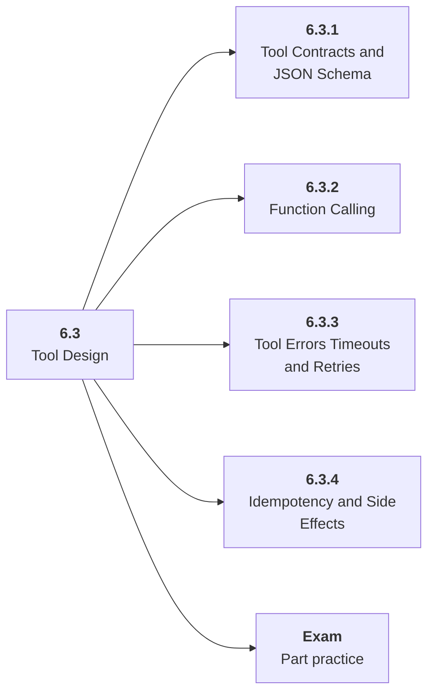

# 6.3 Tool Design

## Role at Stage 6: AI Agents

Give agents safe, typed, observable interfaces to useful software capabilities. This part is one capability inside the stage. It should leave behind an artifact, measurements, and a short explanation of failure modes.

## Explanation

This part has 4 sub-parts because the topic needs that many learning units to feel natural. Some stages have more parts and some have fewer; the structure follows the topic, not a fixed template.

## Part Diagram

## Sub-Parts

| Sub-part folder | What it explains |
|---|---|
| [6.3.1 Tool Contracts and JSON Schema](<6.3.1 Tool Contracts and JSON Schema/index.md>) | Tool Contracts and JSON Schema is the working skill inside Tool Design that helps you build the stage artifact, A tool-using agent with typed tools, memory, traces, task evals, prompt-injection tests, and an architecture README, while collecting enough evidence to trust the result. |
| [6.3.2 Function Calling](<6.3.2 Function Calling/index.md>) | Function Calling is the working skill inside Tool Design that helps you build the stage artifact, A tool-using agent with typed tools, memory, traces, task evals, prompt-injection tests, and an architecture README, while collecting enough evidence to trust the result. |
| [6.3.3 Tool Errors Timeouts and Retries](<6.3.3 Tool Errors Timeouts and Retries/index.md>) | Tool Errors Timeouts and Retries is the working skill inside Tool Design that helps you build the stage artifact, A tool-using agent with typed tools, memory, traces, task evals, prompt-injection tests, and an architecture README, while collecting enough evidence to trust the result. |
| [6.3.4 Idempotency and Side Effects](<6.3.4 Idempotency and Side Effects/index.md>) | Idempotency and Side Effects is the working skill inside Tool Design that helps you build the stage artifact, A tool-using agent with typed tools, memory, traces, task evals, prompt-injection tests, and an architecture README, while collecting enough evidence to trust the result. |

## What a Person Who Masters This Part Can Do

- Explain how Tool Design supports a tool-using agent with typed tools, memory, traces, task evals, prompt-injection tests, and an architecture readme..
- Build and inspect this artifact: Create three typed tools.
- Measure progress with: Track schema validity, tool success, retries, and permission blocks.
- Debug at least one failure mode before moving to the next part.

## Build and Measure

**Build:** Create three typed tools.

**Measure:** Track schema validity, tool success, retries, and permission blocks.

## Tests

Take one 30-question exam after studying this part. It opens in a new browser tab so the study page stays available.

  <a href="test/exam.html" target="_blank" rel="noopener">Open Part Exam</a>

## Back to Stage

Return to [Stage 6: AI Agents](<../index.md>).
