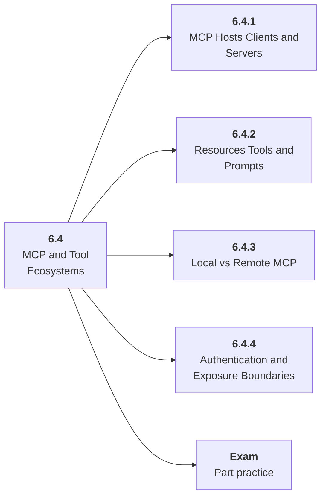

# 6.4 MCP and Tool Ecosystems

## Role at Stage 6: AI Agents

Use Model Context Protocol concepts to expose tools and resources with clear boundaries. This part is one capability inside the stage. It should leave behind an artifact, measurements, and a short explanation of failure modes.

## Explanation

This part has 4 sub-parts because the topic needs that many learning units to feel natural. Some stages have more parts and some have fewer; the structure follows the topic, not a fixed template.

## Part Diagram

## Sub-Parts

| Sub-part folder | What it explains |
|---|---|
| [6.4.1 MCP Hosts Clients and Servers](<6.4.1 MCP Hosts Clients and Servers/index.md>) | MCP Hosts Clients and Servers is the working skill inside MCP and Tool Ecosystems that helps you build the stage artifact, A tool-using agent with typed tools, memory, traces, task evals, prompt-injection tests, and an architecture README, while collecting enough evidence to trust the result. |
| [6.4.2 Resources Tools and Prompts](<6.4.2 Resources Tools and Prompts/index.md>) | Resources Tools and Prompts is the working skill inside MCP and Tool Ecosystems that helps you build the stage artifact, A tool-using agent with typed tools, memory, traces, task evals, prompt-injection tests, and an architecture README, while collecting enough evidence to trust the result. |
| [6.4.3 Local vs Remote MCP](<6.4.3 Local vs Remote MCP/index.md>) | Local vs Remote MCP is the working skill inside MCP and Tool Ecosystems that helps you build the stage artifact, A tool-using agent with typed tools, memory, traces, task evals, prompt-injection tests, and an architecture README, while collecting enough evidence to trust the result. |
| [6.4.4 Authentication and Exposure Boundaries](<6.4.4 Authentication and Exposure Boundaries/index.md>) | Authentication and Exposure Boundaries is the working skill inside MCP and Tool Ecosystems that helps you build the stage artifact, A tool-using agent with typed tools, memory, traces, task evals, prompt-injection tests, and an architecture README, while collecting enough evidence to trust the result. |

## What a Person Who Masters This Part Can Do

- Explain how MCP and Tool Ecosystems supports a tool-using agent with typed tools, memory, traces, task evals, prompt-injection tests, and an architecture readme..
- Build and inspect this artifact: Create one MCP-style tool server or documented equivalent.
- Measure progress with: Track exposed resources, permissions, auth, and host integration.
- Debug at least one failure mode before moving to the next part.

## Build and Measure

**Build:** Create one MCP-style tool server or documented equivalent.

**Measure:** Track exposed resources, permissions, auth, and host integration.

## Tests

Take one 30-question exam after studying this part. It opens in a new browser tab so the study page stays available.

  <a href="test/exam.html" target="_blank" rel="noopener">Open Part Exam</a>

## Back to Stage

Return to [Stage 6: AI Agents](<../index.md>).
