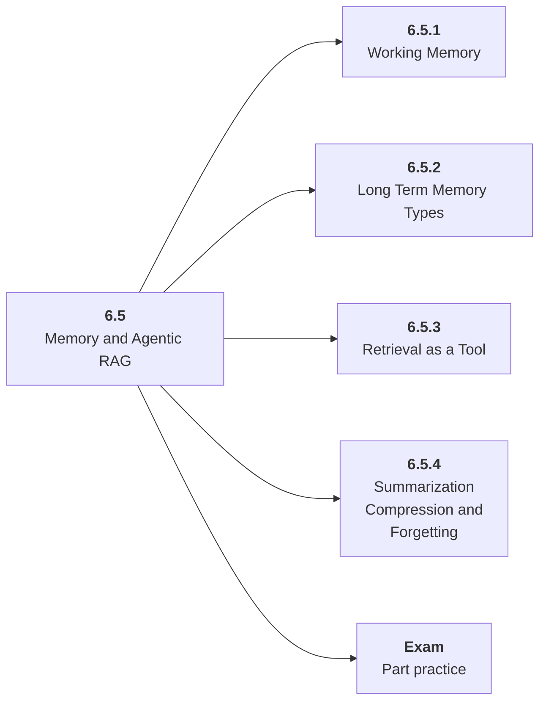

# 6.5 Memory and Agentic RAG

## Role at Stage 6: AI Agents

Manage short-term state, long-term memory, retrieval, summarization, and forgetting. This part is one capability inside the stage. It should leave behind an artifact, measurements, and a short explanation of failure modes.

## Explanation

This part has 4 sub-parts because the topic needs that many learning units to feel natural. Some stages have more parts and some have fewer; the structure follows the topic, not a fixed template.

## Part Diagram

## Sub-Parts

| Sub-part folder | What it explains |
|---|---|
| [6.5.1 Working Memory](<6.5.1 Working Memory/index.md>) | Working Memory is the working skill inside Memory and Agentic RAG that helps you build the stage artifact, A tool-using agent with typed tools, memory, traces, task evals, prompt-injection tests, and an architecture README, while collecting enough evidence to trust the result. |
| [6.5.2 Long Term Memory Types](<6.5.2 Long Term Memory Types/index.md>) | Long Term Memory Types is the working skill inside Memory and Agentic RAG that helps you build the stage artifact, A tool-using agent with typed tools, memory, traces, task evals, prompt-injection tests, and an architecture README, while collecting enough evidence to trust the result. |
| [6.5.3 Retrieval as a Tool](<6.5.3 Retrieval as a Tool/index.md>) | Retrieval as a Tool is the working skill inside Memory and Agentic RAG that helps you build the stage artifact, A tool-using agent with typed tools, memory, traces, task evals, prompt-injection tests, and an architecture README, while collecting enough evidence to trust the result. |
| [6.5.4 Summarization Compression and Forgetting](<6.5.4 Summarization Compression and Forgetting/index.md>) | Summarization Compression and Forgetting is the working skill inside Memory and Agentic RAG that helps you build the stage artifact, A tool-using agent with typed tools, memory, traces, task evals, prompt-injection tests, and an architecture README, while collecting enough evidence to trust the result. |

## What a Person Who Masters This Part Can Do

- Explain how Memory and Agentic RAG supports a tool-using agent with typed tools, memory, traces, task evals, prompt-injection tests, and an architecture readme..
- Build and inspect this artifact: Build an agent with retrieval and selective memory.
- Measure progress with: Track retrieval quality, memory precision, stale memory, and context size.
- Debug at least one failure mode before moving to the next part.

## Build and Measure

**Build:** Build an agent with retrieval and selective memory.

**Measure:** Track retrieval quality, memory precision, stale memory, and context size.

## Tests

Take one 30-question exam after studying this part. It opens in a new browser tab so the study page stays available.

  <a href="test/exam.html" target="_blank" rel="noopener">Open Part Exam</a>

## Back to Stage

Return to [Stage 6: AI Agents](<../index.md>).
