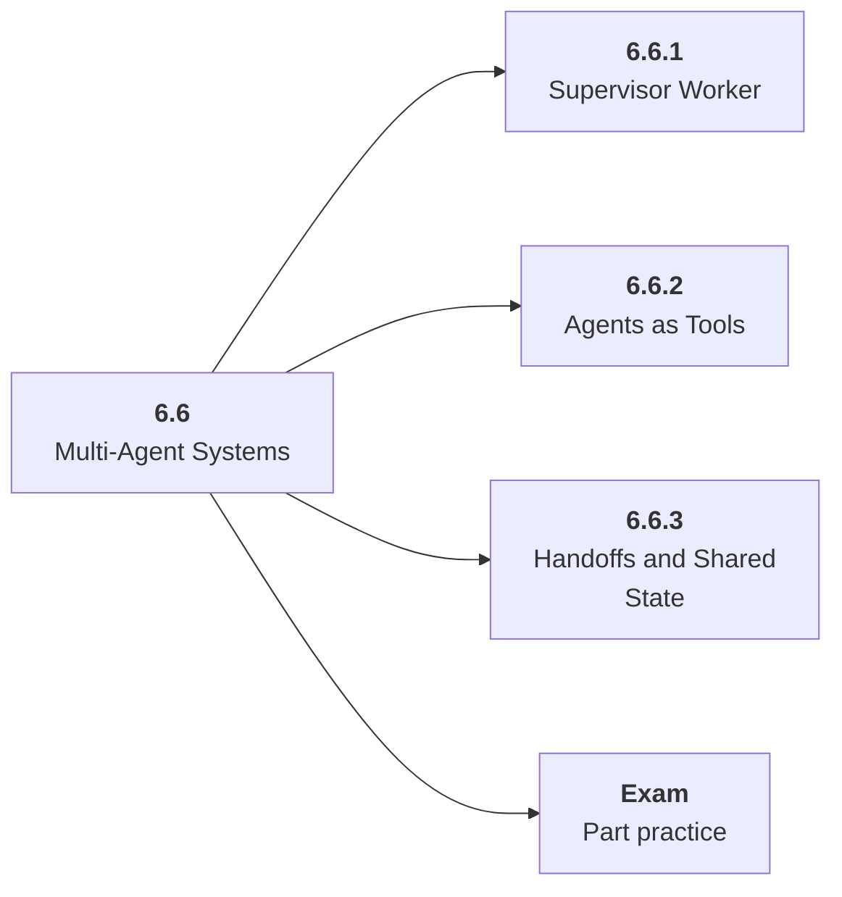

# 6.6 Multi-Agent Systems

## Role at Stage 6: AI Agents

Coordinate specialized agents only when the extra communication improves outcomes. This part is one capability inside the stage. It should leave behind an artifact, measurements, and a short explanation of failure modes.

## Explanation

This part has 3 sub-parts because the topic needs that many learning units to feel natural. Some stages have more parts and some have fewer; the structure follows the topic, not a fixed template.

## Part Diagram

## Sub-Parts

| Sub-part folder | What it explains |
|---|---|
| [6.6.1 Supervisor Worker](<6.6.1 Supervisor Worker/index.md>) | Supervisor Worker is the working skill inside Multi-Agent Systems that helps you build the stage artifact, A tool-using agent with typed tools, memory, traces, task evals, prompt-injection tests, and an architecture README, while collecting enough evidence to trust the result. |
| [6.6.2 Agents as Tools](<6.6.2 Agents as Tools/index.md>) | Agents as Tools is the working skill inside Multi-Agent Systems that helps you build the stage artifact, A tool-using agent with typed tools, memory, traces, task evals, prompt-injection tests, and an architecture README, while collecting enough evidence to trust the result. |
| [6.6.3 Handoffs and Shared State](<6.6.3 Handoffs and Shared State/index.md>) | Handoffs and Shared State is the working skill inside Multi-Agent Systems that helps you build the stage artifact, A tool-using agent with typed tools, memory, traces, task evals, prompt-injection tests, and an architecture README, while collecting enough evidence to trust the result. |

## What a Person Who Masters This Part Can Do

- Explain how Multi-Agent Systems supports a tool-using agent with typed tools, memory, traces, task evals, prompt-injection tests, and an architecture readme..
- Build and inspect this artifact: Build a planner-researcher-writer-reviewer comparison.
- Measure progress with: Track handoff success, conflicts, cost, latency, and quality lift.
- Debug at least one failure mode before moving to the next part.

## Build and Measure

**Build:** Build a planner-researcher-writer-reviewer comparison.

**Measure:** Track handoff success, conflicts, cost, latency, and quality lift.

## Tests

Take one 30-question exam after studying this part. It opens in a new browser tab so the study page stays available.

  <a href="test/exam.html" target="_blank" rel="noopener">Open Part Exam</a>

## Back to Stage

Return to [Stage 6: AI Agents](<../index.md>).
