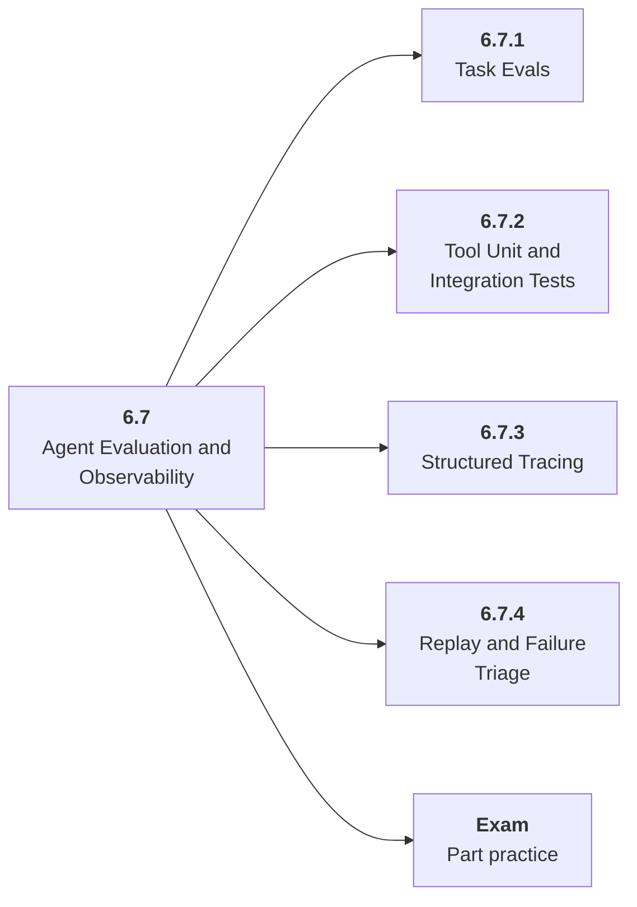

# 6.7 Agent Evaluation and Observability

## Role at Stage 6: AI Agents

Make runs inspectable through task evals, tool tests, traces, metrics, and replay. This part is one capability inside the stage. It should leave behind an artifact, measurements, and a short explanation of failure modes.

## Explanation

This part has 4 sub-parts because the topic needs that many learning units to feel natural. Some stages have more parts and some have fewer; the structure follows the topic, not a fixed template.

## Part Diagram

## Sub-Parts

| Sub-part folder | What it explains |
|---|---|
| [6.7.1 Task Evals](<6.7.1 Task Evals/index.md>) | Task Evals is the working skill inside Agent Evaluation and Observability that helps you build the stage artifact, A tool-using agent with typed tools, memory, traces, task evals, prompt-injection tests, and an architecture README, while collecting enough evidence to trust the result. |
| [6.7.2 Tool Unit and Integration Tests](<6.7.2 Tool Unit and Integration Tests/index.md>) | Tool Unit and Integration Tests is the working skill inside Agent Evaluation and Observability that helps you build the stage artifact, A tool-using agent with typed tools, memory, traces, task evals, prompt-injection tests, and an architecture README, while collecting enough evidence to trust the result. |
| [6.7.3 Structured Tracing](<6.7.3 Structured Tracing/index.md>) | Structured Tracing is the working skill inside Agent Evaluation and Observability that helps you build the stage artifact, A tool-using agent with typed tools, memory, traces, task evals, prompt-injection tests, and an architecture README, while collecting enough evidence to trust the result. |
| [6.7.4 Replay and Failure Triage](<6.7.4 Replay and Failure Triage/index.md>) | Replay and Failure Triage is the working skill inside Agent Evaluation and Observability that helps you build the stage artifact, A tool-using agent with typed tools, memory, traces, task evals, prompt-injection tests, and an architecture README, while collecting enough evidence to trust the result. |

## What a Person Who Masters This Part Can Do

- Explain how Agent Evaluation and Observability supports a tool-using agent with typed tools, memory, traces, task evals, prompt-injection tests, and an architecture readme..
- Build and inspect this artifact: Add evals and tracing to the agent.
- Measure progress with: Track success, trace completeness, tool errors, cost, and latency.
- Debug at least one failure mode before moving to the next part.

## Build and Measure

**Build:** Add evals and tracing to the agent.

**Measure:** Track success, trace completeness, tool errors, cost, and latency.

## Tests

Take one 30-question exam after studying this part. It opens in a new browser tab so the study page stays available.

  <a href="test/exam.html" target="_blank" rel="noopener">Open Part Exam</a>

## Back to Stage

Return to [Stage 6: AI Agents](<../index.md>).
