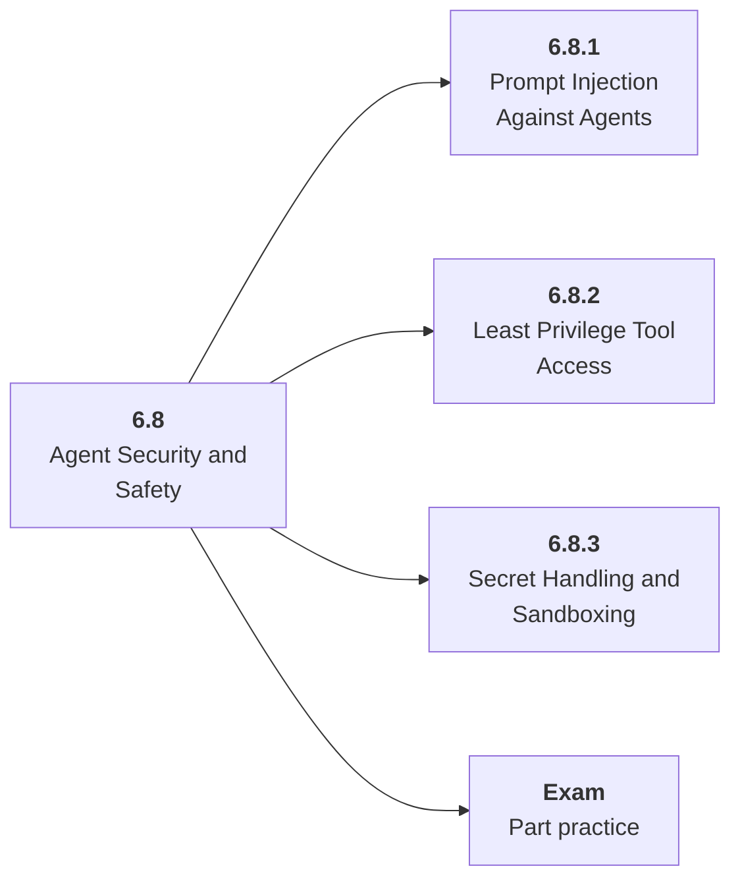

# 6.8 Agent Security and Safety

## Role at Stage 6: AI Agents

Defend against prompt injection, tool abuse, secret leaks, and excessive agency. This part is one capability inside the stage. It should leave behind an artifact, measurements, and a short explanation of failure modes.

## Explanation

This part has 3 sub-parts because the topic needs that many learning units to feel natural. Some stages have more parts and some have fewer; the structure follows the topic, not a fixed template.

## Part Diagram

## Sub-Parts

| Sub-part folder | What it explains |
|---|---|
| [6.8.1 Prompt Injection Against Agents](<6.8.1 Prompt Injection Against Agents/index.md>) | Prompt Injection Against Agents is the working skill inside Agent Security and Safety that helps you build the stage artifact, A tool-using agent with typed tools, memory, traces, task evals, prompt-injection tests, and an architecture README, while collecting enough evidence to trust the result. |
| [6.8.2 Least Privilege Tool Access](<6.8.2 Least Privilege Tool Access/index.md>) | Least Privilege Tool Access is the working skill inside Agent Security and Safety that helps you build the stage artifact, A tool-using agent with typed tools, memory, traces, task evals, prompt-injection tests, and an architecture README, while collecting enough evidence to trust the result. |
| [6.8.3 Secret Handling and Sandboxing](<6.8.3 Secret Handling and Sandboxing/index.md>) | Secret Handling and Sandboxing is the working skill inside Agent Security and Safety that helps you build the stage artifact, A tool-using agent with typed tools, memory, traces, task evals, prompt-injection tests, and an architecture README, while collecting enough evidence to trust the result. |

## What a Person Who Masters This Part Can Do

- Explain how Agent Security and Safety supports a tool-using agent with typed tools, memory, traces, task evals, prompt-injection tests, and an architecture readme..
- Build and inspect this artifact: Red-team the agent and add mitigations.
- Measure progress with: Track attack success before and after mitigation.
- Debug at least one failure mode before moving to the next part.

## Build and Measure

**Build:** Red-team the agent and add mitigations.

**Measure:** Track attack success before and after mitigation.

## Tests

Take one 30-question exam after studying this part. It opens in a new browser tab so the study page stays available.

  <a href="test/exam.html" target="_blank" rel="noopener">Open Part Exam</a>

## Back to Stage

Return to [Stage 6: AI Agents](<../index.md>).
