# Stage 6: AI Agents

6 Build controlled tool-using systems, not vague autonomy.

## Goal

Learn the agent loop, planning, tools, MCP, memory, multi-agent coordination, evaluation, observability, and security boundaries.

## Roadmap to Master This Stage

1. Read the stage goal and diagram before opening the parts.
2. Move through the parts in order unless you can already pass the exit criteria.
3. Study each sub-part folder: overview, deep dive, and examples/practice.
4. Build the stage artifact in small slices and measure the listed metrics.
5. Use the part exam after each part, or open the global Exam tab to test across the roadmap.

## Stage Structure Diagram

```mermaid
%%{init: {"flowchart": {"htmlLabels": true, "nodeSpacing": 70, "rankSpacing": 90}, "themeVariables": {"fontSize": "18px"}} }%%
flowchart LR
  P1["<b>6.1</b><br/>Agent Loop Fundamentals"]
  P2["<b>6.2</b><br/>Reasoning and Planning<br/>Patterns"]
  P1 --> P2
  P3["<b>6.3</b><br/>Tool Design"]
  P2 --> P3
  P4["<b>6.4</b><br/>MCP and Tool Ecosystems"]
  P3 --> P4
  P5["<b>6.5</b><br/>Memory and Agentic RAG"]
  P4 --> P5
  P6["<b>6.6</b><br/>Multi-Agent Systems"]
  P5 --> P6
  P7["<b>6.7</b><br/>Agent Evaluation and<br/>Observability"]
  P6 --> P7
  P8["<b>6.8</b><br/>Agent Security and<br/>Safety"]
  P7 --> P8
```

## Parts

| Part | Simple explanation | Build focus |
|---|---|---|
| [6.1 Agent Loop Fundamentals](<6.1 Agent Loop Fundamentals/index.md>) | Build the observe-think-act-observe-finish loop explicitly before using frameworks. | Build a manual ReAct-style agent. |
| [6.2 Reasoning and Planning Patterns](<6.2 Reasoning and Planning Patterns/index.md>) | Use planning, decomposition, reflection, and routing only when the task needs them. | Compare direct, ReAct, and planner-executor designs. |
| [6.3 Tool Design](<6.3 Tool Design/index.md>) | Give agents safe, typed, observable interfaces to useful software capabilities. | Create three typed tools. |
| [6.4 MCP and Tool Ecosystems](<6.4 MCP and Tool Ecosystems/index.md>) | Use Model Context Protocol concepts to expose tools and resources with clear boundaries. | Create one MCP-style tool server or documented equivalent. |
| [6.5 Memory and Agentic RAG](<6.5 Memory and Agentic RAG/index.md>) | Manage short-term state, long-term memory, retrieval, summarization, and forgetting. | Build an agent with retrieval and selective memory. |
| [6.6 Multi-Agent Systems](<6.6 Multi-Agent Systems/index.md>) | Coordinate specialized agents only when the extra communication improves outcomes. | Build a planner-researcher-writer-reviewer comparison. |
| [6.7 Agent Evaluation and Observability](<6.7 Agent Evaluation and Observability/index.md>) | Make runs inspectable through task evals, tool tests, traces, metrics, and replay. | Add evals and tracing to the agent. |
| [6.8 Agent Security and Safety](<6.8 Agent Security and Safety/index.md>) | Defend against prompt injection, tool abuse, secret leaks, and excessive agency. | Red-team the agent and add mitigations. |

## Sub-Part Map

| Part | Sub-part | Why it matters |
|---|---|---|
| 6.1 | [6.1.1 Agent State and Messages](<6.1 Agent Loop Fundamentals/6.1.1 Agent State and Messages/index.md>) | Agent State and Messages is the working skill inside Agent Loop Fundamentals that helps you build the stage artifact, A tool-using agent with typed tools, memory, traces, task evals, prompt-injection tests, and an architecture README, while collecting enough evidence to trust the result. |
| 6.1 | [6.1.2 Observe Reason Act Observe](<6.1 Agent Loop Fundamentals/6.1.2 Observe Reason Act Observe/index.md>) | Observe Reason Act Observe is the working skill inside Agent Loop Fundamentals that helps you build the stage artifact, A tool-using agent with typed tools, memory, traces, task evals, prompt-injection tests, and an architecture README, while collecting enough evidence to trust the result. |
| 6.1 | [6.1.3 Final Answer and Stop Rules](<6.1 Agent Loop Fundamentals/6.1.3 Final Answer and Stop Rules/index.md>) | Final Answer and Stop Rules is the working skill inside Agent Loop Fundamentals that helps you build the stage artifact, A tool-using agent with typed tools, memory, traces, task evals, prompt-injection tests, and an architecture README, while collecting enough evidence to trust the result. |
| 6.1 | [6.1.4 Loop Budget and Cancellation](<6.1 Agent Loop Fundamentals/6.1.4 Loop Budget and Cancellation/index.md>) | Loop Budget and Cancellation is the working skill inside Agent Loop Fundamentals that helps you build the stage artifact, A tool-using agent with typed tools, memory, traces, task evals, prompt-injection tests, and an architecture README, while collecting enough evidence to trust the result. |
| 6.2 | [6.2.1 ReAct Pattern](<6.2 Reasoning and Planning Patterns/6.2.1 ReAct Pattern/index.md>) | ReAct Pattern is the working skill inside Reasoning and Planning Patterns that helps you build the stage artifact, A tool-using agent with typed tools, memory, traces, task evals, prompt-injection tests, and an architecture README, while collecting enough evidence to trust the result. |
| 6.2 | [6.2.2 Planner Executor](<6.2 Reasoning and Planning Patterns/6.2.2 Planner Executor/index.md>) | Planner Executor is the working skill inside Reasoning and Planning Patterns that helps you build the stage artifact, A tool-using agent with typed tools, memory, traces, task evals, prompt-injection tests, and an architecture README, while collecting enough evidence to trust the result. |
| 6.2 | [6.2.3 Reflection and Self Critique](<6.2 Reasoning and Planning Patterns/6.2.3 Reflection and Self Critique/index.md>) | Reflection and Self Critique is the working skill inside Reasoning and Planning Patterns that helps you build the stage artifact, A tool-using agent with typed tools, memory, traces, task evals, prompt-injection tests, and an architecture README, while collecting enough evidence to trust the result. |
| 6.2 | [6.2.4 Routing and Workflow Agents](<6.2 Reasoning and Planning Patterns/6.2.4 Routing and Workflow Agents/index.md>) | Routing and Workflow Agents is the working skill inside Reasoning and Planning Patterns that helps you build the stage artifact, A tool-using agent with typed tools, memory, traces, task evals, prompt-injection tests, and an architecture README, while collecting enough evidence to trust the result. |
| 6.3 | [6.3.1 Tool Contracts and JSON Schema](<6.3 Tool Design/6.3.1 Tool Contracts and JSON Schema/index.md>) | Tool Contracts and JSON Schema is the working skill inside Tool Design that helps you build the stage artifact, A tool-using agent with typed tools, memory, traces, task evals, prompt-injection tests, and an architecture README, while collecting enough evidence to trust the result. |
| 6.3 | [6.3.2 Function Calling](<6.3 Tool Design/6.3.2 Function Calling/index.md>) | Function Calling is the working skill inside Tool Design that helps you build the stage artifact, A tool-using agent with typed tools, memory, traces, task evals, prompt-injection tests, and an architecture README, while collecting enough evidence to trust the result. |
| 6.3 | [6.3.3 Tool Errors Timeouts and Retries](<6.3 Tool Design/6.3.3 Tool Errors Timeouts and Retries/index.md>) | Tool Errors Timeouts and Retries is the working skill inside Tool Design that helps you build the stage artifact, A tool-using agent with typed tools, memory, traces, task evals, prompt-injection tests, and an architecture README, while collecting enough evidence to trust the result. |
| 6.3 | [6.3.4 Idempotency and Side Effects](<6.3 Tool Design/6.3.4 Idempotency and Side Effects/index.md>) | Idempotency and Side Effects is the working skill inside Tool Design that helps you build the stage artifact, A tool-using agent with typed tools, memory, traces, task evals, prompt-injection tests, and an architecture README, while collecting enough evidence to trust the result. |
| 6.4 | [6.4.1 MCP Hosts Clients and Servers](<6.4 MCP and Tool Ecosystems/6.4.1 MCP Hosts Clients and Servers/index.md>) | MCP Hosts Clients and Servers is the working skill inside MCP and Tool Ecosystems that helps you build the stage artifact, A tool-using agent with typed tools, memory, traces, task evals, prompt-injection tests, and an architecture README, while collecting enough evidence to trust the result. |
| 6.4 | [6.4.2 Resources Tools and Prompts](<6.4 MCP and Tool Ecosystems/6.4.2 Resources Tools and Prompts/index.md>) | Resources Tools and Prompts is the working skill inside MCP and Tool Ecosystems that helps you build the stage artifact, A tool-using agent with typed tools, memory, traces, task evals, prompt-injection tests, and an architecture README, while collecting enough evidence to trust the result. |
| 6.4 | [6.4.3 Local vs Remote MCP](<6.4 MCP and Tool Ecosystems/6.4.3 Local vs Remote MCP/index.md>) | Local vs Remote MCP is the working skill inside MCP and Tool Ecosystems that helps you build the stage artifact, A tool-using agent with typed tools, memory, traces, task evals, prompt-injection tests, and an architecture README, while collecting enough evidence to trust the result. |
| 6.4 | [6.4.4 Authentication and Exposure Boundaries](<6.4 MCP and Tool Ecosystems/6.4.4 Authentication and Exposure Boundaries/index.md>) | Authentication and Exposure Boundaries is the working skill inside MCP and Tool Ecosystems that helps you build the stage artifact, A tool-using agent with typed tools, memory, traces, task evals, prompt-injection tests, and an architecture README, while collecting enough evidence to trust the result. |
| 6.5 | [6.5.1 Working Memory](<6.5 Memory and Agentic RAG/6.5.1 Working Memory/index.md>) | Working Memory is the working skill inside Memory and Agentic RAG that helps you build the stage artifact, A tool-using agent with typed tools, memory, traces, task evals, prompt-injection tests, and an architecture README, while collecting enough evidence to trust the result. |
| 6.5 | [6.5.2 Long Term Memory Types](<6.5 Memory and Agentic RAG/6.5.2 Long Term Memory Types/index.md>) | Long Term Memory Types is the working skill inside Memory and Agentic RAG that helps you build the stage artifact, A tool-using agent with typed tools, memory, traces, task evals, prompt-injection tests, and an architecture README, while collecting enough evidence to trust the result. |
| 6.5 | [6.5.3 Retrieval as a Tool](<6.5 Memory and Agentic RAG/6.5.3 Retrieval as a Tool/index.md>) | Retrieval as a Tool is the working skill inside Memory and Agentic RAG that helps you build the stage artifact, A tool-using agent with typed tools, memory, traces, task evals, prompt-injection tests, and an architecture README, while collecting enough evidence to trust the result. |
| 6.5 | [6.5.4 Summarization Compression and Forgetting](<6.5 Memory and Agentic RAG/6.5.4 Summarization Compression and Forgetting/index.md>) | Summarization Compression and Forgetting is the working skill inside Memory and Agentic RAG that helps you build the stage artifact, A tool-using agent with typed tools, memory, traces, task evals, prompt-injection tests, and an architecture README, while collecting enough evidence to trust the result. |
| 6.6 | [6.6.1 Supervisor Worker](<6.6 Multi-Agent Systems/6.6.1 Supervisor Worker/index.md>) | Supervisor Worker is the working skill inside Multi-Agent Systems that helps you build the stage artifact, A tool-using agent with typed tools, memory, traces, task evals, prompt-injection tests, and an architecture README, while collecting enough evidence to trust the result. |
| 6.6 | [6.6.2 Agents as Tools](<6.6 Multi-Agent Systems/6.6.2 Agents as Tools/index.md>) | Agents as Tools is the working skill inside Multi-Agent Systems that helps you build the stage artifact, A tool-using agent with typed tools, memory, traces, task evals, prompt-injection tests, and an architecture README, while collecting enough evidence to trust the result. |
| 6.6 | [6.6.3 Handoffs and Shared State](<6.6 Multi-Agent Systems/6.6.3 Handoffs and Shared State/index.md>) | Handoffs and Shared State is the working skill inside Multi-Agent Systems that helps you build the stage artifact, A tool-using agent with typed tools, memory, traces, task evals, prompt-injection tests, and an architecture README, while collecting enough evidence to trust the result. |
| 6.7 | [6.7.1 Task Evals](<6.7 Agent Evaluation and Observability/6.7.1 Task Evals/index.md>) | Task Evals is the working skill inside Agent Evaluation and Observability that helps you build the stage artifact, A tool-using agent with typed tools, memory, traces, task evals, prompt-injection tests, and an architecture README, while collecting enough evidence to trust the result. |
| 6.7 | [6.7.2 Tool Unit and Integration Tests](<6.7 Agent Evaluation and Observability/6.7.2 Tool Unit and Integration Tests/index.md>) | Tool Unit and Integration Tests is the working skill inside Agent Evaluation and Observability that helps you build the stage artifact, A tool-using agent with typed tools, memory, traces, task evals, prompt-injection tests, and an architecture README, while collecting enough evidence to trust the result. |
| 6.7 | [6.7.3 Structured Tracing](<6.7 Agent Evaluation and Observability/6.7.3 Structured Tracing/index.md>) | Structured Tracing is the working skill inside Agent Evaluation and Observability that helps you build the stage artifact, A tool-using agent with typed tools, memory, traces, task evals, prompt-injection tests, and an architecture README, while collecting enough evidence to trust the result. |
| 6.7 | [6.7.4 Replay and Failure Triage](<6.7 Agent Evaluation and Observability/6.7.4 Replay and Failure Triage/index.md>) | Replay and Failure Triage is the working skill inside Agent Evaluation and Observability that helps you build the stage artifact, A tool-using agent with typed tools, memory, traces, task evals, prompt-injection tests, and an architecture README, while collecting enough evidence to trust the result. |
| 6.8 | [6.8.1 Prompt Injection Against Agents](<6.8 Agent Security and Safety/6.8.1 Prompt Injection Against Agents/index.md>) | Prompt Injection Against Agents is the working skill inside Agent Security and Safety that helps you build the stage artifact, A tool-using agent with typed tools, memory, traces, task evals, prompt-injection tests, and an architecture README, while collecting enough evidence to trust the result. |
| 6.8 | [6.8.2 Least Privilege Tool Access](<6.8 Agent Security and Safety/6.8.2 Least Privilege Tool Access/index.md>) | Least Privilege Tool Access is the working skill inside Agent Security and Safety that helps you build the stage artifact, A tool-using agent with typed tools, memory, traces, task evals, prompt-injection tests, and an architecture README, while collecting enough evidence to trust the result. |
| 6.8 | [6.8.3 Secret Handling and Sandboxing](<6.8 Agent Security and Safety/6.8.3 Secret Handling and Sandboxing/index.md>) | Secret Handling and Sandboxing is the working skill inside Agent Security and Safety that helps you build the stage artifact, A tool-using agent with typed tools, memory, traces, task evals, prompt-injection tests, and an architecture README, while collecting enough evidence to trust the result. |

## Stage Artifact

A tool-using agent with typed tools, memory, traces, task evals, prompt-injection tests, and an architecture README.

## What to Measure

- task success rate
- tool error rate
- loop step count
- cost per successful task
- security test pass rate

## Exit Criteria

- implement a manual agent loop
- design typed tools and permissions
- use memory intentionally
- trace, evaluate, and red-team runs

## Navigation

Previous: [Stage 5: AI Applications](<../5. AI Applications/index.md>) | Next: [Stage 7: Model Infrastructure](<../7. Model Infrastructure/index.md>)
