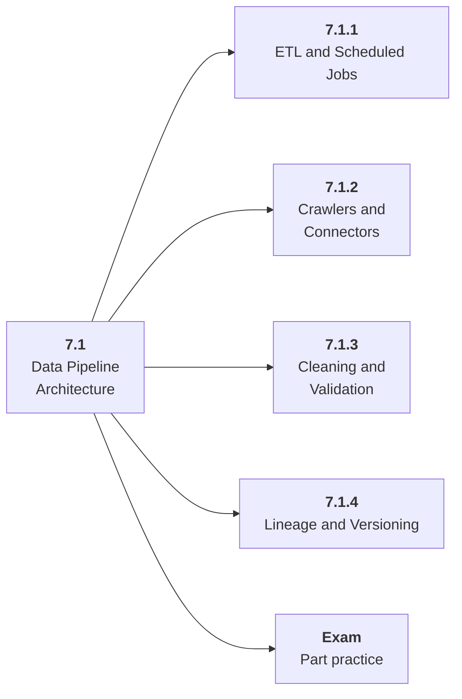

# 7.1 Data Pipeline Architecture

## Role at Stage 7: Model Infrastructure

Move raw data through repeatable ingestion, cleaning, validation, and lineage steps. This part is one capability inside the stage. It should leave behind an artifact, measurements, and a short explanation of failure modes.

## Explanation

This part has 4 sub-parts because the topic needs that many learning units to feel natural. Some stages have more parts and some have fewer; the structure follows the topic, not a fixed template.

## Part Diagram

## Sub-Parts

| Sub-part folder | What it explains |
|---|---|
| [7.1.1 ETL and Scheduled Jobs](<7.1.1 ETL and Scheduled Jobs/index.md>) | ETL and Scheduled Jobs is the working skill inside Data Pipeline Architecture that helps you build the stage artifact, A deployed model-backed service with data or retrieval pipeline, registry metadata, eval checks, structured logs, and dashboards, while collecting enough evidence to trust the result. |
| [7.1.2 Crawlers and Connectors](<7.1.2 Crawlers and Connectors/index.md>) | Crawlers and Connectors is the working skill inside Data Pipeline Architecture that helps you build the stage artifact, A deployed model-backed service with data or retrieval pipeline, registry metadata, eval checks, structured logs, and dashboards, while collecting enough evidence to trust the result. |
| [7.1.3 Cleaning and Validation](<7.1.3 Cleaning and Validation/index.md>) | Cleaning and Validation is the working skill inside Data Pipeline Architecture that helps you build the stage artifact, A deployed model-backed service with data or retrieval pipeline, registry metadata, eval checks, structured logs, and dashboards, while collecting enough evidence to trust the result. |
| [7.1.4 Lineage and Versioning](<7.1.4 Lineage and Versioning/index.md>) | Lineage and Versioning is the working skill inside Data Pipeline Architecture that helps you build the stage artifact, A deployed model-backed service with data or retrieval pipeline, registry metadata, eval checks, structured logs, and dashboards, while collecting enough evidence to trust the result. |

## What a Person Who Masters This Part Can Do

- Explain how Data Pipeline Architecture supports a deployed model-backed service with data or retrieval pipeline, registry metadata, eval checks, structured logs, and dashboards..
- Build and inspect this artifact: Create an ETL pipeline.
- Measure progress with: Track records, rejected rows, schema versions, and lineage.
- Debug at least one failure mode before moving to the next part.

## Build and Measure

**Build:** Create an ETL pipeline.

**Measure:** Track records, rejected rows, schema versions, and lineage.

## Tests

Take one 30-question exam after studying this part. It opens in a new browser tab so the study page stays available.

  <a href="test/exam.html" target="_blank" rel="noopener">Open Part Exam</a>

## Back to Stage

Return to [Stage 7: Model Infrastructure](<../index.md>).
