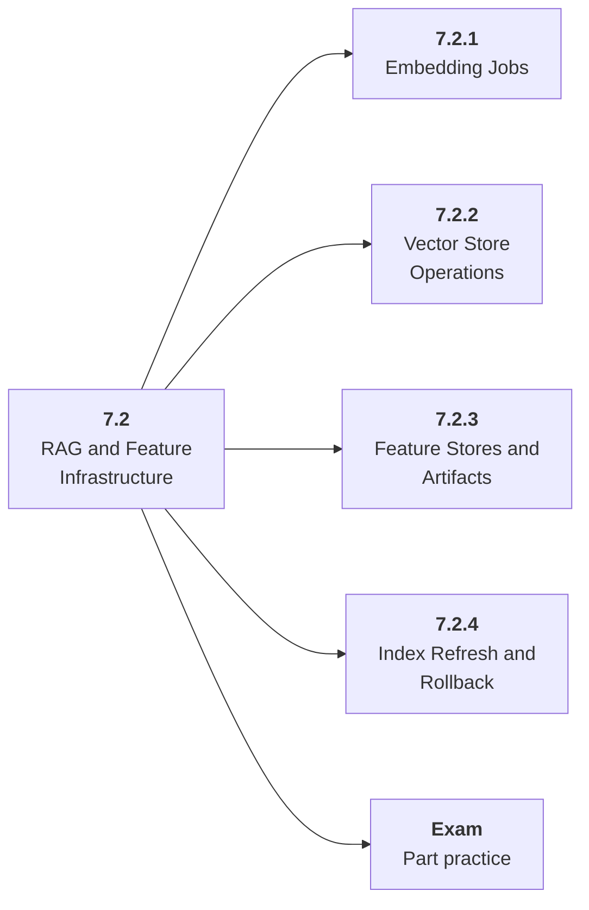

# 7.2 RAG and Feature Infrastructure

## Role at Stage 7: Model Infrastructure

Operate embeddings, vector indexes, feature artifacts, and refresh jobs as production assets. This part is one capability inside the stage. It should leave behind an artifact, measurements, and a short explanation of failure modes.

## Explanation

This part has 4 sub-parts because the topic needs that many learning units to feel natural. Some stages have more parts and some have fewer; the structure follows the topic, not a fixed template.

## Part Diagram

## Sub-Parts

| Sub-part folder | What it explains |
|---|---|
| [7.2.1 Embedding Jobs](<7.2.1 Embedding Jobs/index.md>) | Embedding Jobs is the working skill inside RAG and Feature Infrastructure that helps you build the stage artifact, A deployed model-backed service with data or retrieval pipeline, registry metadata, eval checks, structured logs, and dashboards, while collecting enough evidence to trust the result. |
| [7.2.2 Vector Store Operations](<7.2.2 Vector Store Operations/index.md>) | Vector Store Operations is the working skill inside RAG and Feature Infrastructure that helps you build the stage artifact, A deployed model-backed service with data or retrieval pipeline, registry metadata, eval checks, structured logs, and dashboards, while collecting enough evidence to trust the result. |
| [7.2.3 Feature Stores and Artifacts](<7.2.3 Feature Stores and Artifacts/index.md>) | Feature Stores and Artifacts is the working skill inside RAG and Feature Infrastructure that helps you build the stage artifact, A deployed model-backed service with data or retrieval pipeline, registry metadata, eval checks, structured logs, and dashboards, while collecting enough evidence to trust the result. |
| [7.2.4 Index Refresh and Rollback](<7.2.4 Index Refresh and Rollback/index.md>) | Index Refresh and Rollback is the working skill inside RAG and Feature Infrastructure that helps you build the stage artifact, A deployed model-backed service with data or retrieval pipeline, registry metadata, eval checks, structured logs, and dashboards, while collecting enough evidence to trust the result. |

## What a Person Who Masters This Part Can Do

- Explain how RAG and Feature Infrastructure supports a deployed model-backed service with data or retrieval pipeline, registry metadata, eval checks, structured logs, and dashboards..
- Build and inspect this artifact: Build a rebuildable vector index pipeline.
- Measure progress with: Track chunks, embedding model, metadata, index version, and rollback.
- Debug at least one failure mode before moving to the next part.

## Build and Measure

**Build:** Build a rebuildable vector index pipeline.

**Measure:** Track chunks, embedding model, metadata, index version, and rollback.

## Tests

Take one 30-question exam after studying this part. It opens in a new browser tab so the study page stays available.

  <a href="test/exam.html" target="_blank" rel="noopener">Open Part Exam</a>

## Back to Stage

Return to [Stage 7: Model Infrastructure](<../index.md>).
