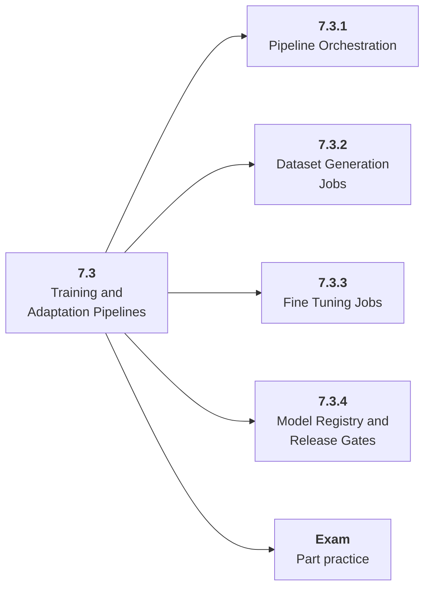

# 7.3 Training and Adaptation Pipelines

## Role at Stage 7: Model Infrastructure

Automate dataset generation, fine-tuning, evaluation, and artifact export. This part is one capability inside the stage. It should leave behind an artifact, measurements, and a short explanation of failure modes.

## Explanation

This part has 4 sub-parts because the topic needs that many learning units to feel natural. Some stages have more parts and some have fewer; the structure follows the topic, not a fixed template.

## Part Diagram

## Sub-Parts

| Sub-part folder | What it explains |
|---|---|
| [7.3.1 Pipeline Orchestration](<7.3.1 Pipeline Orchestration/index.md>) | Pipeline Orchestration is the working skill inside Training and Adaptation Pipelines that helps you build the stage artifact, A deployed model-backed service with data or retrieval pipeline, registry metadata, eval checks, structured logs, and dashboards, while collecting enough evidence to trust the result. |
| [7.3.2 Dataset Generation Jobs](<7.3.2 Dataset Generation Jobs/index.md>) | Dataset Generation Jobs is the working skill inside Training and Adaptation Pipelines that helps you build the stage artifact, A deployed model-backed service with data or retrieval pipeline, registry metadata, eval checks, structured logs, and dashboards, while collecting enough evidence to trust the result. |
| [7.3.3 Fine Tuning Jobs](<7.3.3 Fine Tuning Jobs/index.md>) | Fine Tuning Jobs is the working skill inside Training and Adaptation Pipelines that helps you build the stage artifact, A deployed model-backed service with data or retrieval pipeline, registry metadata, eval checks, structured logs, and dashboards, while collecting enough evidence to trust the result. |
| [7.3.4 Model Registry and Release Gates](<7.3.4 Model Registry and Release Gates/index.md>) | Model Registry and Release Gates is the working skill inside Training and Adaptation Pipelines that helps you build the stage artifact, A deployed model-backed service with data or retrieval pipeline, registry metadata, eval checks, structured logs, and dashboards, while collecting enough evidence to trust the result. |

## What a Person Who Masters This Part Can Do

- Explain how Training and Adaptation Pipelines supports a deployed model-backed service with data or retrieval pipeline, registry metadata, eval checks, structured logs, and dashboards..
- Build and inspect this artifact: Create a generate-train-evaluate-export pipeline.
- Measure progress with: Track dataset version, config, checkpoint, report, and promotion decision.
- Debug at least one failure mode before moving to the next part.

## Build and Measure

**Build:** Create a generate-train-evaluate-export pipeline.

**Measure:** Track dataset version, config, checkpoint, report, and promotion decision.

## Tests

Take one 30-question exam after studying this part. It opens in a new browser tab so the study page stays available.

  <a href="test/exam.html" target="_blank" rel="noopener">Open Part Exam</a>

## Back to Stage

Return to [Stage 7: Model Infrastructure](<../index.md>).
