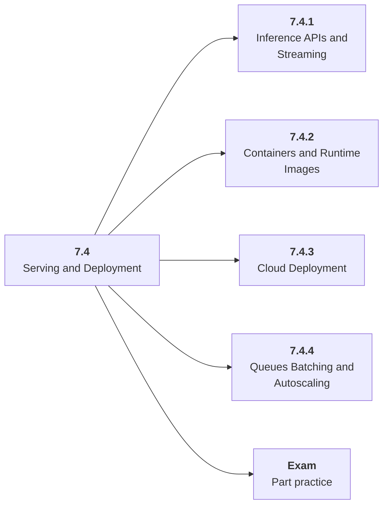

# 7.4 Serving and Deployment

## Role at Stage 7: Model Infrastructure

Expose model behavior through reliable APIs, containers, streaming, batching, and deployment environments. This part is one capability inside the stage. It should leave behind an artifact, measurements, and a short explanation of failure modes.

## Explanation

This part has 4 sub-parts because the topic needs that many learning units to feel natural. Some stages have more parts and some have fewer; the structure follows the topic, not a fixed template.

## Part Diagram

## Sub-Parts

| Sub-part folder | What it explains |
|---|---|
| [7.4.1 Inference APIs and Streaming](<7.4.1 Inference APIs and Streaming/index.md>) | Inference APIs and Streaming is the working skill inside Serving and Deployment that helps you build the stage artifact, A deployed model-backed service with data or retrieval pipeline, registry metadata, eval checks, structured logs, and dashboards, while collecting enough evidence to trust the result. |
| [7.4.2 Containers and Runtime Images](<7.4.2 Containers and Runtime Images/index.md>) | Containers and Runtime Images is the working skill inside Serving and Deployment that helps you build the stage artifact, A deployed model-backed service with data or retrieval pipeline, registry metadata, eval checks, structured logs, and dashboards, while collecting enough evidence to trust the result. |
| [7.4.3 Cloud Deployment](<7.4.3 Cloud Deployment/index.md>) | Cloud Deployment is the working skill inside Serving and Deployment that helps you build the stage artifact, A deployed model-backed service with data or retrieval pipeline, registry metadata, eval checks, structured logs, and dashboards, while collecting enough evidence to trust the result. |
| [7.4.4 Queues Batching and Autoscaling](<7.4.4 Queues Batching and Autoscaling/index.md>) | Queues Batching and Autoscaling is the working skill inside Serving and Deployment that helps you build the stage artifact, A deployed model-backed service with data or retrieval pipeline, registry metadata, eval checks, structured logs, and dashboards, while collecting enough evidence to trust the result. |

## What a Person Who Masters This Part Can Do

- Explain how Serving and Deployment supports a deployed model-backed service with data or retrieval pipeline, registry metadata, eval checks, structured logs, and dashboards..
- Build and inspect this artifact: Deploy a model-backed endpoint.
- Measure progress with: Track cold start, p95, throughput, errors, and reproducibility.
- Debug at least one failure mode before moving to the next part.

## Build and Measure

**Build:** Deploy a model-backed endpoint.

**Measure:** Track cold start, p95, throughput, errors, and reproducibility.

## Tests

Take one 30-question exam after studying this part. It opens in a new browser tab so the study page stays available.

  <a href="test/exam.html" target="_blank" rel="noopener">Open Part Exam</a>

## Back to Stage

Return to [Stage 7: Model Infrastructure](<../index.md>).
