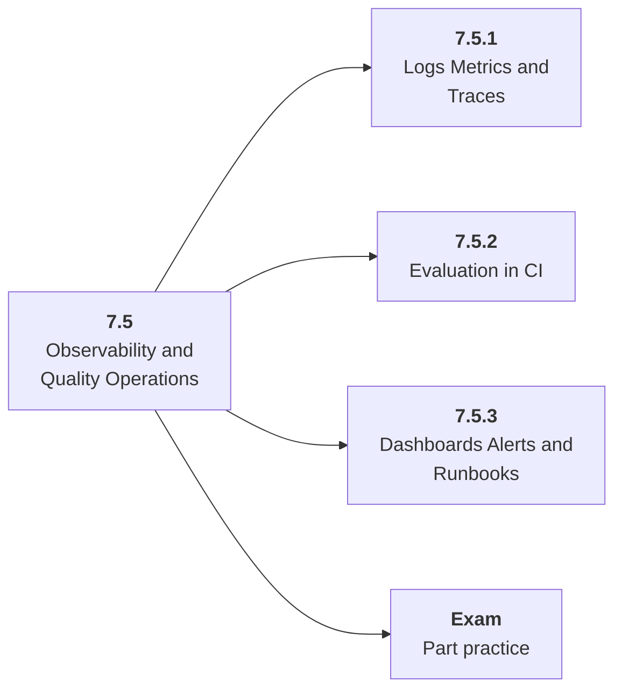

# 7.5 Observability and Quality Operations

## Role at Stage 7: Model Infrastructure

Instrument AI systems across prompts, retrieval, model calls, tools, traces, and quality metrics. This part is one capability inside the stage. It should leave behind an artifact, measurements, and a short explanation of failure modes.

## Explanation

This part has 3 sub-parts because the topic needs that many learning units to feel natural. Some stages have more parts and some have fewer; the structure follows the topic, not a fixed template.

## Part Diagram

## Sub-Parts

| Sub-part folder | What it explains |
|---|---|
| [7.5.1 Logs Metrics and Traces](<7.5.1 Logs Metrics and Traces/index.md>) | Logs Metrics and Traces is the working skill inside Observability and Quality Operations that helps you build the stage artifact, A deployed model-backed service with data or retrieval pipeline, registry metadata, eval checks, structured logs, and dashboards, while collecting enough evidence to trust the result. |
| [7.5.2 Evaluation in CI](<7.5.2 Evaluation in CI/index.md>) | Evaluation in CI is the working skill inside Observability and Quality Operations that helps you build the stage artifact, A deployed model-backed service with data or retrieval pipeline, registry metadata, eval checks, structured logs, and dashboards, while collecting enough evidence to trust the result. |
| [7.5.3 Dashboards Alerts and Runbooks](<7.5.3 Dashboards Alerts and Runbooks/index.md>) | Dashboards Alerts and Runbooks is the working skill inside Observability and Quality Operations that helps you build the stage artifact, A deployed model-backed service with data or retrieval pipeline, registry metadata, eval checks, structured logs, and dashboards, while collecting enough evidence to trust the result. |

## What a Person Who Masters This Part Can Do

- Explain how Observability and Quality Operations supports a deployed model-backed service with data or retrieval pipeline, registry metadata, eval checks, structured logs, and dashboards..
- Build and inspect this artifact: Add dashboards and alert rules.
- Measure progress with: Track traces, eval pass rate, latency, errors, token use, and privacy-safe logs.
- Debug at least one failure mode before moving to the next part.

## Build and Measure

**Build:** Add dashboards and alert rules.

**Measure:** Track traces, eval pass rate, latency, errors, token use, and privacy-safe logs.

## Tests

Take one 30-question exam after studying this part. It opens in a new browser tab so the study page stays available.

  <a href="test/exam.html" target="_blank" rel="noopener">Open Part Exam</a>

## Back to Stage

Return to [Stage 7: Model Infrastructure](<../index.md>).
