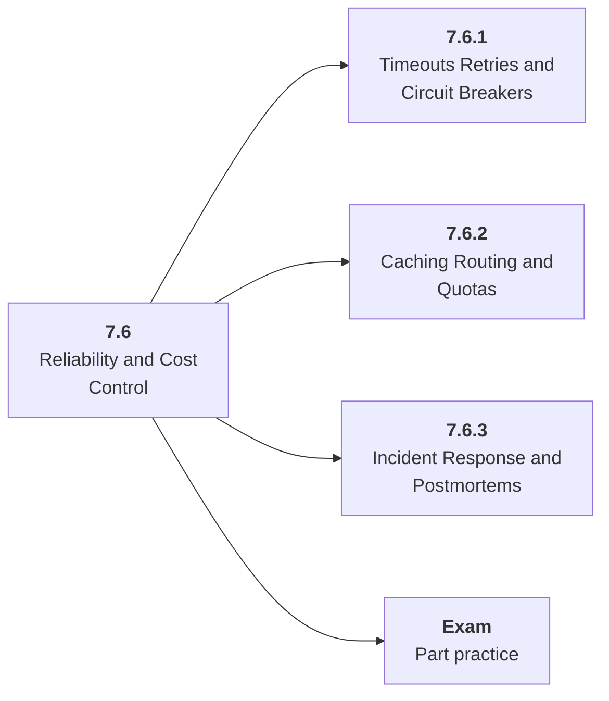

# 7.6 Reliability and Cost Control

## Role at Stage 7: Model Infrastructure

Prevent dependency failures, runaway retries, quota blowups, and silent quality regressions. This part is one capability inside the stage. It should leave behind an artifact, measurements, and a short explanation of failure modes.

## Explanation

This part has 3 sub-parts because the topic needs that many learning units to feel natural. Some stages have more parts and some have fewer; the structure follows the topic, not a fixed template.

## Part Diagram

## Sub-Parts

| Sub-part folder | What it explains |
|---|---|
| [7.6.1 Timeouts Retries and Circuit Breakers](<7.6.1 Timeouts Retries and Circuit Breakers/index.md>) | Timeouts Retries and Circuit Breakers is the working skill inside Reliability and Cost Control that helps you build the stage artifact, A deployed model-backed service with data or retrieval pipeline, registry metadata, eval checks, structured logs, and dashboards, while collecting enough evidence to trust the result. |
| [7.6.2 Caching Routing and Quotas](<7.6.2 Caching Routing and Quotas/index.md>) | Caching Routing and Quotas is the working skill inside Reliability and Cost Control that helps you build the stage artifact, A deployed model-backed service with data or retrieval pipeline, registry metadata, eval checks, structured logs, and dashboards, while collecting enough evidence to trust the result. |
| [7.6.3 Incident Response and Postmortems](<7.6.3 Incident Response and Postmortems/index.md>) | Incident Response and Postmortems is the working skill inside Reliability and Cost Control that helps you build the stage artifact, A deployed model-backed service with data or retrieval pipeline, registry metadata, eval checks, structured logs, and dashboards, while collecting enough evidence to trust the result. |

## What a Person Who Masters This Part Can Do

- Explain how Reliability and Cost Control supports a deployed model-backed service with data or retrieval pipeline, registry metadata, eval checks, structured logs, and dashboards..
- Build and inspect this artifact: Add reliability controls and budget alerts.
- Measure progress with: Track retry rate, circuit breaks, cache hits, spend, and recovery time.
- Debug at least one failure mode before moving to the next part.

## Build and Measure

**Build:** Add reliability controls and budget alerts.

**Measure:** Track retry rate, circuit breaks, cache hits, spend, and recovery time.

## Tests

Take one 30-question exam after studying this part. It opens in a new browser tab so the study page stays available.

  <a href="test/exam.html" target="_blank" rel="noopener">Open Part Exam</a>

## Back to Stage

Return to [Stage 7: Model Infrastructure](<../index.md>).
