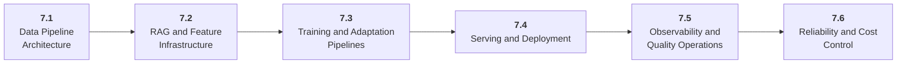

# Stage 7: Model Infrastructure

7 Operate AI systems as production software.

## Goal

Build the infrastructure layer for data pipelines, model adaptation pipelines, serving, deployment, observability, reliability, and cost control.

## Roadmap to Master This Stage

1. Read the stage goal and diagram before opening the parts.
2. Move through the parts in order unless you can already pass the exit criteria.
3. Study each sub-part folder: overview, deep dive, and examples/practice.
4. Build the stage artifact in small slices and measure the listed metrics.
5. Use the part exam after each part, or open the global Exam tab to test across the roadmap.

## Stage Structure Diagram

## Parts

| Part | Simple explanation | Build focus |
|---|---|---|
| [7.1 Data Pipeline Architecture](<7.1 Data Pipeline Architecture/index.md>) | Move raw data through repeatable ingestion, cleaning, validation, and lineage steps. | Create an ETL pipeline. |
| [7.2 RAG and Feature Infrastructure](<7.2 RAG and Feature Infrastructure/index.md>) | Operate embeddings, vector indexes, feature artifacts, and refresh jobs as production assets. | Build a rebuildable vector index pipeline. |
| [7.3 Training and Adaptation Pipelines](<7.3 Training and Adaptation Pipelines/index.md>) | Automate dataset generation, fine-tuning, evaluation, and artifact export. | Create a generate-train-evaluate-export pipeline. |
| [7.4 Serving and Deployment](<7.4 Serving and Deployment/index.md>) | Expose model behavior through reliable APIs, containers, streaming, batching, and deployment environments. | Deploy a model-backed endpoint. |
| [7.5 Observability and Quality Operations](<7.5 Observability and Quality Operations/index.md>) | Instrument AI systems across prompts, retrieval, model calls, tools, traces, and quality metrics. | Add dashboards and alert rules. |
| [7.6 Reliability and Cost Control](<7.6 Reliability and Cost Control/index.md>) | Prevent dependency failures, runaway retries, quota blowups, and silent quality regressions. | Add reliability controls and budget alerts. |

## Sub-Part Map

| Part | Sub-part | Why it matters |
|---|---|---|
| 7.1 | [7.1.1 ETL and Scheduled Jobs](<7.1 Data Pipeline Architecture/7.1.1 ETL and Scheduled Jobs/index.md>) | ETL and Scheduled Jobs is the working skill inside Data Pipeline Architecture that helps you build the stage artifact, A deployed model-backed service with data or retrieval pipeline, registry metadata, eval checks, structured logs, and dashboards, while collecting enough evidence to trust the result. |
| 7.1 | [7.1.2 Crawlers and Connectors](<7.1 Data Pipeline Architecture/7.1.2 Crawlers and Connectors/index.md>) | Crawlers and Connectors is the working skill inside Data Pipeline Architecture that helps you build the stage artifact, A deployed model-backed service with data or retrieval pipeline, registry metadata, eval checks, structured logs, and dashboards, while collecting enough evidence to trust the result. |
| 7.1 | [7.1.3 Cleaning and Validation](<7.1 Data Pipeline Architecture/7.1.3 Cleaning and Validation/index.md>) | Cleaning and Validation is the working skill inside Data Pipeline Architecture that helps you build the stage artifact, A deployed model-backed service with data or retrieval pipeline, registry metadata, eval checks, structured logs, and dashboards, while collecting enough evidence to trust the result. |
| 7.1 | [7.1.4 Lineage and Versioning](<7.1 Data Pipeline Architecture/7.1.4 Lineage and Versioning/index.md>) | Lineage and Versioning is the working skill inside Data Pipeline Architecture that helps you build the stage artifact, A deployed model-backed service with data or retrieval pipeline, registry metadata, eval checks, structured logs, and dashboards, while collecting enough evidence to trust the result. |
| 7.2 | [7.2.1 Embedding Jobs](<7.2 RAG and Feature Infrastructure/7.2.1 Embedding Jobs/index.md>) | Embedding Jobs is the working skill inside RAG and Feature Infrastructure that helps you build the stage artifact, A deployed model-backed service with data or retrieval pipeline, registry metadata, eval checks, structured logs, and dashboards, while collecting enough evidence to trust the result. |
| 7.2 | [7.2.2 Vector Store Operations](<7.2 RAG and Feature Infrastructure/7.2.2 Vector Store Operations/index.md>) | Vector Store Operations is the working skill inside RAG and Feature Infrastructure that helps you build the stage artifact, A deployed model-backed service with data or retrieval pipeline, registry metadata, eval checks, structured logs, and dashboards, while collecting enough evidence to trust the result. |
| 7.2 | [7.2.3 Feature Stores and Artifacts](<7.2 RAG and Feature Infrastructure/7.2.3 Feature Stores and Artifacts/index.md>) | Feature Stores and Artifacts is the working skill inside RAG and Feature Infrastructure that helps you build the stage artifact, A deployed model-backed service with data or retrieval pipeline, registry metadata, eval checks, structured logs, and dashboards, while collecting enough evidence to trust the result. |
| 7.2 | [7.2.4 Index Refresh and Rollback](<7.2 RAG and Feature Infrastructure/7.2.4 Index Refresh and Rollback/index.md>) | Index Refresh and Rollback is the working skill inside RAG and Feature Infrastructure that helps you build the stage artifact, A deployed model-backed service with data or retrieval pipeline, registry metadata, eval checks, structured logs, and dashboards, while collecting enough evidence to trust the result. |
| 7.3 | [7.3.1 Pipeline Orchestration](<7.3 Training and Adaptation Pipelines/7.3.1 Pipeline Orchestration/index.md>) | Pipeline Orchestration is the working skill inside Training and Adaptation Pipelines that helps you build the stage artifact, A deployed model-backed service with data or retrieval pipeline, registry metadata, eval checks, structured logs, and dashboards, while collecting enough evidence to trust the result. |
| 7.3 | [7.3.2 Dataset Generation Jobs](<7.3 Training and Adaptation Pipelines/7.3.2 Dataset Generation Jobs/index.md>) | Dataset Generation Jobs is the working skill inside Training and Adaptation Pipelines that helps you build the stage artifact, A deployed model-backed service with data or retrieval pipeline, registry metadata, eval checks, structured logs, and dashboards, while collecting enough evidence to trust the result. |
| 7.3 | [7.3.3 Fine Tuning Jobs](<7.3 Training and Adaptation Pipelines/7.3.3 Fine Tuning Jobs/index.md>) | Fine Tuning Jobs is the working skill inside Training and Adaptation Pipelines that helps you build the stage artifact, A deployed model-backed service with data or retrieval pipeline, registry metadata, eval checks, structured logs, and dashboards, while collecting enough evidence to trust the result. |
| 7.3 | [7.3.4 Model Registry and Release Gates](<7.3 Training and Adaptation Pipelines/7.3.4 Model Registry and Release Gates/index.md>) | Model Registry and Release Gates is the working skill inside Training and Adaptation Pipelines that helps you build the stage artifact, A deployed model-backed service with data or retrieval pipeline, registry metadata, eval checks, structured logs, and dashboards, while collecting enough evidence to trust the result. |
| 7.4 | [7.4.1 Inference APIs and Streaming](<7.4 Serving and Deployment/7.4.1 Inference APIs and Streaming/index.md>) | Inference APIs and Streaming is the working skill inside Serving and Deployment that helps you build the stage artifact, A deployed model-backed service with data or retrieval pipeline, registry metadata, eval checks, structured logs, and dashboards, while collecting enough evidence to trust the result. |
| 7.4 | [7.4.2 Containers and Runtime Images](<7.4 Serving and Deployment/7.4.2 Containers and Runtime Images/index.md>) | Containers and Runtime Images is the working skill inside Serving and Deployment that helps you build the stage artifact, A deployed model-backed service with data or retrieval pipeline, registry metadata, eval checks, structured logs, and dashboards, while collecting enough evidence to trust the result. |
| 7.4 | [7.4.3 Cloud Deployment](<7.4 Serving and Deployment/7.4.3 Cloud Deployment/index.md>) | Cloud Deployment is the working skill inside Serving and Deployment that helps you build the stage artifact, A deployed model-backed service with data or retrieval pipeline, registry metadata, eval checks, structured logs, and dashboards, while collecting enough evidence to trust the result. |
| 7.4 | [7.4.4 Queues Batching and Autoscaling](<7.4 Serving and Deployment/7.4.4 Queues Batching and Autoscaling/index.md>) | Queues Batching and Autoscaling is the working skill inside Serving and Deployment that helps you build the stage artifact, A deployed model-backed service with data or retrieval pipeline, registry metadata, eval checks, structured logs, and dashboards, while collecting enough evidence to trust the result. |
| 7.5 | [7.5.1 Logs Metrics and Traces](<7.5 Observability and Quality Operations/7.5.1 Logs Metrics and Traces/index.md>) | Logs Metrics and Traces is the working skill inside Observability and Quality Operations that helps you build the stage artifact, A deployed model-backed service with data or retrieval pipeline, registry metadata, eval checks, structured logs, and dashboards, while collecting enough evidence to trust the result. |
| 7.5 | [7.5.2 Evaluation in CI](<7.5 Observability and Quality Operations/7.5.2 Evaluation in CI/index.md>) | Evaluation in CI is the working skill inside Observability and Quality Operations that helps you build the stage artifact, A deployed model-backed service with data or retrieval pipeline, registry metadata, eval checks, structured logs, and dashboards, while collecting enough evidence to trust the result. |
| 7.5 | [7.5.3 Dashboards Alerts and Runbooks](<7.5 Observability and Quality Operations/7.5.3 Dashboards Alerts and Runbooks/index.md>) | Dashboards Alerts and Runbooks is the working skill inside Observability and Quality Operations that helps you build the stage artifact, A deployed model-backed service with data or retrieval pipeline, registry metadata, eval checks, structured logs, and dashboards, while collecting enough evidence to trust the result. |
| 7.6 | [7.6.1 Timeouts Retries and Circuit Breakers](<7.6 Reliability and Cost Control/7.6.1 Timeouts Retries and Circuit Breakers/index.md>) | Timeouts Retries and Circuit Breakers is the working skill inside Reliability and Cost Control that helps you build the stage artifact, A deployed model-backed service with data or retrieval pipeline, registry metadata, eval checks, structured logs, and dashboards, while collecting enough evidence to trust the result. |
| 7.6 | [7.6.2 Caching Routing and Quotas](<7.6 Reliability and Cost Control/7.6.2 Caching Routing and Quotas/index.md>) | Caching Routing and Quotas is the working skill inside Reliability and Cost Control that helps you build the stage artifact, A deployed model-backed service with data or retrieval pipeline, registry metadata, eval checks, structured logs, and dashboards, while collecting enough evidence to trust the result. |
| 7.6 | [7.6.3 Incident Response and Postmortems](<7.6 Reliability and Cost Control/7.6.3 Incident Response and Postmortems/index.md>) | Incident Response and Postmortems is the working skill inside Reliability and Cost Control that helps you build the stage artifact, A deployed model-backed service with data or retrieval pipeline, registry metadata, eval checks, structured logs, and dashboards, while collecting enough evidence to trust the result. |

## Stage Artifact

A deployed model-backed service with data or retrieval pipeline, registry metadata, eval checks, structured logs, and dashboards.

## What to Measure

- p50 and p95 latency
- error rate
- eval pass rate
- cost per request
- throughput
- rollback time

## Exit Criteria

- package AI services reproducibly
- run configured pipelines
- deploy model-backed APIs
- monitor quality, latency, cost, and errors

## Navigation

Previous: [Stage 6: AI Agents](<../6. AI Agents/index.md>) | Next: [Stage 8: Optimization and Hardware Acceleration](<../8. Optimization and Hardware/index.md>)
