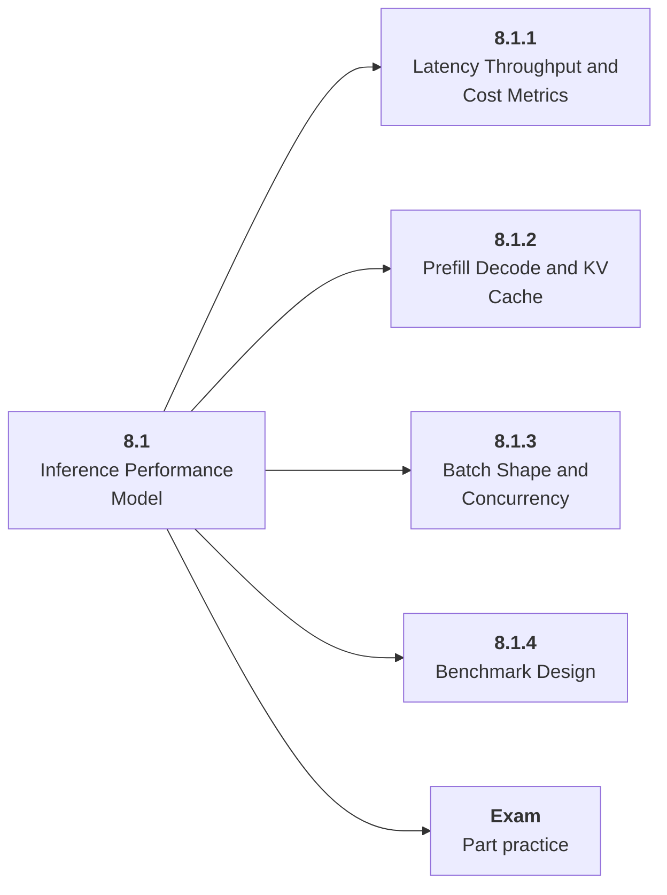

# 8.1 Inference Performance Model

## Role at Stage 8: Optimization and Hardware Acceleration

Use the measurement vocabulary and workload model behind optimization. This part is one capability inside the stage. It should leave behind an artifact, measurements, and a short explanation of failure modes.

## Explanation

This part has 4 sub-parts because the topic needs that many learning units to feel natural. Some stages have more parts and some have fewer; the structure follows the topic, not a fixed template.

## Part Diagram

## Sub-Parts

| Sub-part folder | What it explains |
|---|---|
| [8.1.1 Latency Throughput and Cost Metrics](<8.1.1 Latency Throughput and Cost Metrics/index.md>) | Latency Throughput and Cost Metrics is the working skill inside Inference Performance Model that helps you build the stage artifact, An inference benchmark and optimization report for an open-weight or hosted model workload, while collecting enough evidence to trust the result. |
| [8.1.2 Prefill Decode and KV Cache](<8.1.2 Prefill Decode and KV Cache/index.md>) | Prefill Decode and KV Cache is the working skill inside Inference Performance Model that helps you build the stage artifact, An inference benchmark and optimization report for an open-weight or hosted model workload, while collecting enough evidence to trust the result. |
| [8.1.3 Batch Shape and Concurrency](<8.1.3 Batch Shape and Concurrency/index.md>) | Batch Shape and Concurrency is the working skill inside Inference Performance Model that helps you build the stage artifact, An inference benchmark and optimization report for an open-weight or hosted model workload, while collecting enough evidence to trust the result. |
| [8.1.4 Benchmark Design](<8.1.4 Benchmark Design/index.md>) | Benchmark Design is the working skill inside Inference Performance Model that helps you build the stage artifact, An inference benchmark and optimization report for an open-weight or hosted model workload, while collecting enough evidence to trust the result. |

## What a Person Who Masters This Part Can Do

- Explain how Inference Performance Model supports an inference benchmark and optimization report for an open-weight or hosted model workload..
- Build and inspect this artifact: Benchmark varied prompt, output, and batch shapes.
- Measure progress with: Track TTFT, TPOT, throughput, p95, memory, and quality.
- Debug at least one failure mode before moving to the next part.

## Build and Measure

**Build:** Benchmark varied prompt, output, and batch shapes.

**Measure:** Track TTFT, TPOT, throughput, p95, memory, and quality.

## Tests

Take one 30-question exam after studying this part. It opens in a new browser tab so the study page stays available.

  <a href="test/exam.html" target="_blank" rel="noopener">Open Part Exam</a>

## Back to Stage

Return to [Stage 8: Optimization and Hardware Acceleration](<../index.md>).
