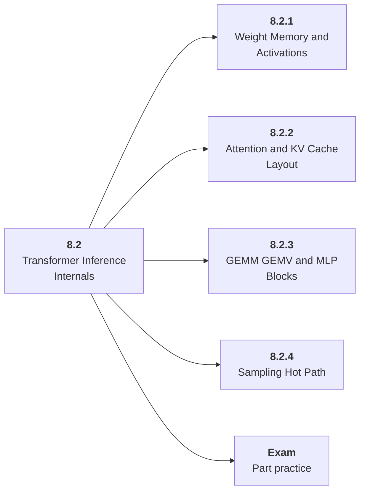

# 8.2 Transformer Inference Internals

## Role at Stage 8: Optimization and Hardware Acceleration

Connect transformer computation to memory bandwidth, attention, cache layout, and sampling. This part is one capability inside the stage. It should leave behind an artifact, measurements, and a short explanation of failure modes.

## Explanation

This part has 4 sub-parts because the topic needs that many learning units to feel natural. Some stages have more parts and some have fewer; the structure follows the topic, not a fixed template.

## Part Diagram

## Sub-Parts

| Sub-part folder | What it explains |
|---|---|
| [8.2.1 Weight Memory and Activations](<8.2.1 Weight Memory and Activations/index.md>) | Weight Memory and Activations is the working skill inside Transformer Inference Internals that helps you build the stage artifact, An inference benchmark and optimization report for an open-weight or hosted model workload, while collecting enough evidence to trust the result. |
| [8.2.2 Attention and KV Cache Layout](<8.2.2 Attention and KV Cache Layout/index.md>) | Attention and KV Cache Layout is the working skill inside Transformer Inference Internals that helps you build the stage artifact, An inference benchmark and optimization report for an open-weight or hosted model workload, while collecting enough evidence to trust the result. |
| [8.2.3 GEMM GEMV and MLP Blocks](<8.2.3 GEMM GEMV and MLP Blocks/index.md>) | GEMM GEMV and MLP Blocks is the working skill inside Transformer Inference Internals that helps you build the stage artifact, An inference benchmark and optimization report for an open-weight or hosted model workload, while collecting enough evidence to trust the result. |
| [8.2.4 Sampling Hot Path](<8.2.4 Sampling Hot Path/index.md>) | Sampling Hot Path is the working skill inside Transformer Inference Internals that helps you build the stage artifact, An inference benchmark and optimization report for an open-weight or hosted model workload, while collecting enough evidence to trust the result. |

## What a Person Who Masters This Part Can Do

- Explain how Transformer Inference Internals supports an inference benchmark and optimization report for an open-weight or hosted model workload..
- Build and inspect this artifact: Trace one decode step for a small model.
- Measure progress with: Track weight memory, KV memory, attention cost, and decode bottleneck.
- Debug at least one failure mode before moving to the next part.

## Build and Measure

**Build:** Trace one decode step for a small model.

**Measure:** Track weight memory, KV memory, attention cost, and decode bottleneck.

## Tests

Take one 30-question exam after studying this part. It opens in a new browser tab so the study page stays available.

  <a href="test/exam.html" target="_blank" rel="noopener">Open Part Exam</a>

## Back to Stage

Return to [Stage 8: Optimization and Hardware Acceleration](<../index.md>).
