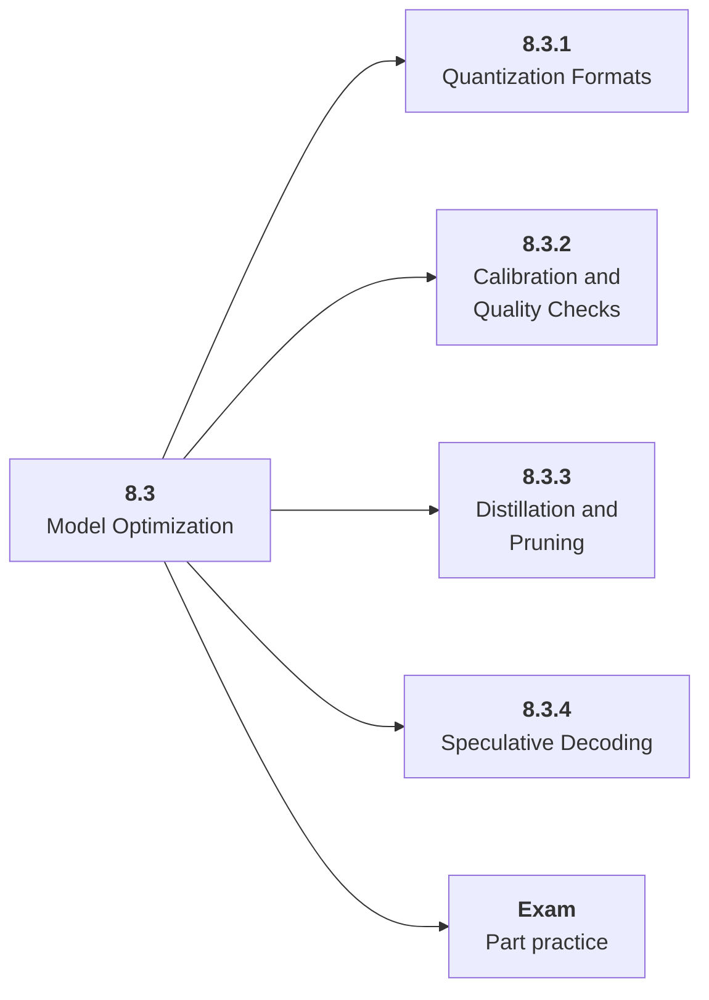

# 8.3 Model Optimization

## Role at Stage 8: Optimization and Hardware Acceleration

Change or approximate computation while measuring quality risk. This part is one capability inside the stage. It should leave behind an artifact, measurements, and a short explanation of failure modes.

## Explanation

This part has 4 sub-parts because the topic needs that many learning units to feel natural. Some stages have more parts and some have fewer; the structure follows the topic, not a fixed template.

## Part Diagram

## Sub-Parts

| Sub-part folder | What it explains |
|---|---|
| [8.3.1 Quantization Formats](<8.3.1 Quantization Formats/index.md>) | Quantization Formats is the working skill inside Model Optimization that helps you build the stage artifact, An inference benchmark and optimization report for an open-weight or hosted model workload, while collecting enough evidence to trust the result. |
| [8.3.2 Calibration and Quality Checks](<8.3.2 Calibration and Quality Checks/index.md>) | Calibration and Quality Checks is the working skill inside Model Optimization that helps you build the stage artifact, An inference benchmark and optimization report for an open-weight or hosted model workload, while collecting enough evidence to trust the result. |
| [8.3.3 Distillation and Pruning](<8.3.3 Distillation and Pruning/index.md>) | Distillation and Pruning is the working skill inside Model Optimization that helps you build the stage artifact, An inference benchmark and optimization report for an open-weight or hosted model workload, while collecting enough evidence to trust the result. |
| [8.3.4 Speculative Decoding](<8.3.4 Speculative Decoding/index.md>) | Speculative Decoding is the working skill inside Model Optimization that helps you build the stage artifact, An inference benchmark and optimization report for an open-weight or hosted model workload, while collecting enough evidence to trust the result. |

## What a Person Who Masters This Part Can Do

- Explain how Model Optimization supports an inference benchmark and optimization report for an open-weight or hosted model workload..
- Build and inspect this artifact: Compare baseline and optimized model variants.
- Measure progress with: Track memory reduction, speedup, eval drop, validity, and failures.
- Debug at least one failure mode before moving to the next part.

## Build and Measure

**Build:** Compare baseline and optimized model variants.

**Measure:** Track memory reduction, speedup, eval drop, validity, and failures.

## Tests

Take one 30-question exam after studying this part. It opens in a new browser tab so the study page stays available.

  <a href="test/exam.html" target="_blank" rel="noopener">Open Part Exam</a>

## Back to Stage

Return to [Stage 8: Optimization and Hardware Acceleration](<../index.md>).
