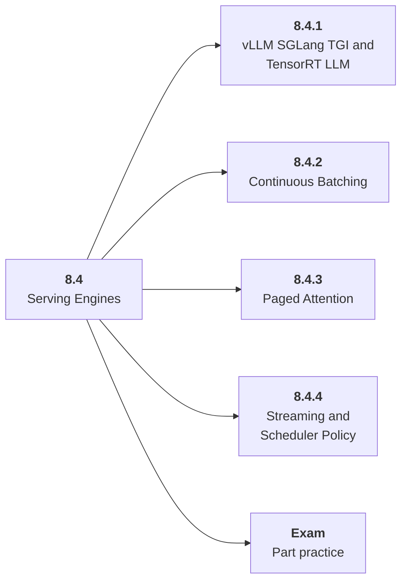

# 8.4 Serving Engines

## Role at Stage 8: Optimization and Hardware Acceleration

Understand how runtimes schedule, batch, stream, and manage model memory. This part is one capability inside the stage. It should leave behind an artifact, measurements, and a short explanation of failure modes.

## Explanation

This part has 4 sub-parts because the topic needs that many learning units to feel natural. Some stages have more parts and some have fewer; the structure follows the topic, not a fixed template.

## Part Diagram

## Sub-Parts

| Sub-part folder | What it explains |
|---|---|
| [8.4.1 vLLM SGLang TGI and TensorRT LLM](<8.4.1 vLLM SGLang TGI and TensorRT LLM/index.md>) | vLLM SGLang TGI and TensorRT LLM is the working skill inside Serving Engines that helps you build the stage artifact, An inference benchmark and optimization report for an open-weight or hosted model workload, while collecting enough evidence to trust the result. |
| [8.4.2 Continuous Batching](<8.4.2 Continuous Batching/index.md>) | Continuous Batching is the working skill inside Serving Engines that helps you build the stage artifact, An inference benchmark and optimization report for an open-weight or hosted model workload, while collecting enough evidence to trust the result. |
| [8.4.3 Paged Attention](<8.4.3 Paged Attention/index.md>) | Paged Attention is the working skill inside Serving Engines that helps you build the stage artifact, An inference benchmark and optimization report for an open-weight or hosted model workload, while collecting enough evidence to trust the result. |
| [8.4.4 Streaming and Scheduler Policy](<8.4.4 Streaming and Scheduler Policy/index.md>) | Streaming and Scheduler Policy is the working skill inside Serving Engines that helps you build the stage artifact, An inference benchmark and optimization report for an open-weight or hosted model workload, while collecting enough evidence to trust the result. |

## What a Person Who Masters This Part Can Do

- Explain how Serving Engines supports an inference benchmark and optimization report for an open-weight or hosted model workload..
- Build and inspect this artifact: Serve a model or design a serving plan.
- Measure progress with: Track throughput, p95, memory, utilization, errors, and cost.
- Debug at least one failure mode before moving to the next part.

## Build and Measure

**Build:** Serve a model or design a serving plan.

**Measure:** Track throughput, p95, memory, utilization, errors, and cost.

## Tests

Take one 30-question exam after studying this part. It opens in a new browser tab so the study page stays available.

  <a href="test/exam.html" target="_blank" rel="noopener">Open Part Exam</a>

## Back to Stage

Return to [Stage 8: Optimization and Hardware Acceleration](<../index.md>).
