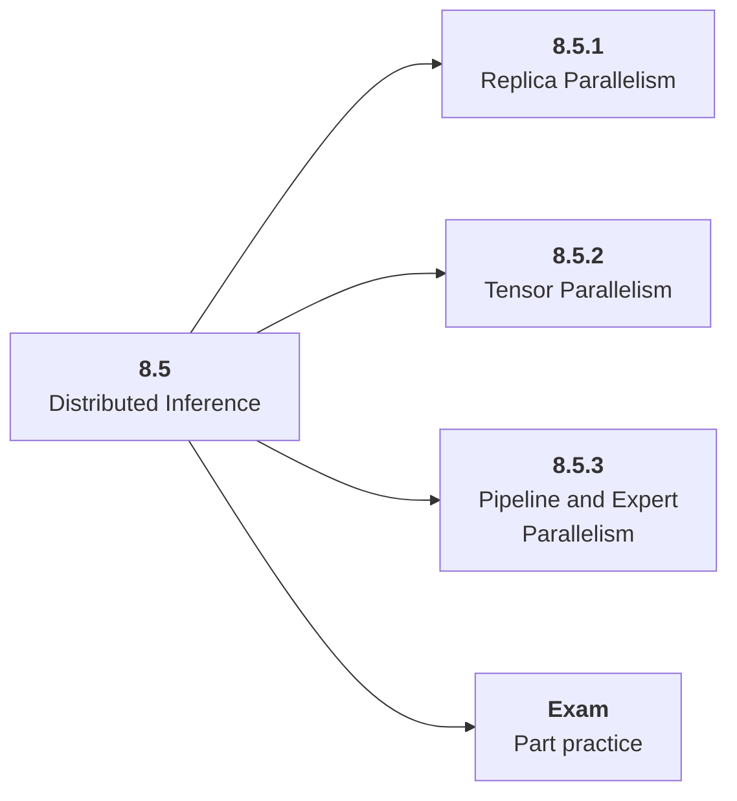

# 8.5 Distributed Inference

## Role at Stage 8: Optimization and Hardware Acceleration

Scale inference across replicas or devices when one process is not enough. This part is one capability inside the stage. It should leave behind an artifact, measurements, and a short explanation of failure modes.

## Explanation

This part has 3 sub-parts because the topic needs that many learning units to feel natural. Some stages have more parts and some have fewer; the structure follows the topic, not a fixed template.

## Part Diagram

## Sub-Parts

| Sub-part folder | What it explains |
|---|---|
| [8.5.1 Replica Parallelism](<8.5.1 Replica Parallelism/index.md>) | Replica Parallelism is the working skill inside Distributed Inference that helps you build the stage artifact, An inference benchmark and optimization report for an open-weight or hosted model workload, while collecting enough evidence to trust the result. |
| [8.5.2 Tensor Parallelism](<8.5.2 Tensor Parallelism/index.md>) | Tensor Parallelism is the working skill inside Distributed Inference that helps you build the stage artifact, An inference benchmark and optimization report for an open-weight or hosted model workload, while collecting enough evidence to trust the result. |
| [8.5.3 Pipeline and Expert Parallelism](<8.5.3 Pipeline and Expert Parallelism/index.md>) | Pipeline and Expert Parallelism is the working skill inside Distributed Inference that helps you build the stage artifact, An inference benchmark and optimization report for an open-weight or hosted model workload, while collecting enough evidence to trust the result. |

## What a Person Who Masters This Part Can Do

- Explain how Distributed Inference supports an inference benchmark and optimization report for an open-weight or hosted model workload..
- Build and inspect this artifact: Design a multi-GPU serving plan.
- Measure progress with: Track memory fit, communication overhead, latency, and capacity.
- Debug at least one failure mode before moving to the next part.

## Build and Measure

**Build:** Design a multi-GPU serving plan.

**Measure:** Track memory fit, communication overhead, latency, and capacity.

## Tests

Take one 30-question exam after studying this part. It opens in a new browser tab so the study page stays available.

  <a href="test/exam.html" target="_blank" rel="noopener">Open Part Exam</a>

## Back to Stage

Return to [Stage 8: Optimization and Hardware Acceleration](<../index.md>).
