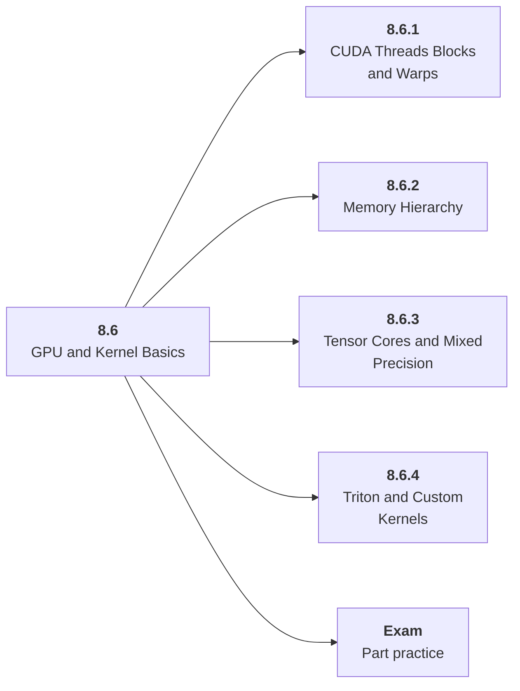

# 8.6 GPU and Kernel Basics

## Role at Stage 8: Optimization and Hardware Acceleration

Build the hardware intuition needed to read profiles and understand bottlenecks. This part is one capability inside the stage. It should leave behind an artifact, measurements, and a short explanation of failure modes.

## Explanation

This part has 4 sub-parts because the topic needs that many learning units to feel natural. Some stages have more parts and some have fewer; the structure follows the topic, not a fixed template.

## Part Diagram

## Sub-Parts

| Sub-part folder | What it explains |
|---|---|
| [8.6.1 CUDA Threads Blocks and Warps](<8.6.1 CUDA Threads Blocks and Warps/index.md>) | CUDA Threads Blocks and Warps is the working skill inside GPU and Kernel Basics that helps you build the stage artifact, An inference benchmark and optimization report for an open-weight or hosted model workload, while collecting enough evidence to trust the result. |
| [8.6.2 Memory Hierarchy](<8.6.2 Memory Hierarchy/index.md>) | Memory Hierarchy is the working skill inside GPU and Kernel Basics that helps you build the stage artifact, An inference benchmark and optimization report for an open-weight or hosted model workload, while collecting enough evidence to trust the result. |
| [8.6.3 Tensor Cores and Mixed Precision](<8.6.3 Tensor Cores and Mixed Precision/index.md>) | Tensor Cores and Mixed Precision is the working skill inside GPU and Kernel Basics that helps you build the stage artifact, An inference benchmark and optimization report for an open-weight or hosted model workload, while collecting enough evidence to trust the result. |
| [8.6.4 Triton and Custom Kernels](<8.6.4 Triton and Custom Kernels/index.md>) | Triton and Custom Kernels is the working skill inside GPU and Kernel Basics that helps you build the stage artifact, An inference benchmark and optimization report for an open-weight or hosted model workload, while collecting enough evidence to trust the result. |

## What a Person Who Masters This Part Can Do

- Explain how GPU and Kernel Basics supports an inference benchmark and optimization report for an open-weight or hosted model workload..
- Build and inspect this artifact: Profile a simple GPU workload.
- Measure progress with: Track occupancy, bandwidth, memory transfers, and kernel time.
- Debug at least one failure mode before moving to the next part.

## Build and Measure

**Build:** Profile a simple GPU workload.

**Measure:** Track occupancy, bandwidth, memory transfers, and kernel time.

## Tests

Take one 30-question exam after studying this part. It opens in a new browser tab so the study page stays available.

  <a href="test/exam.html" target="_blank" rel="noopener">Open Part Exam</a>

## Back to Stage

Return to [Stage 8: Optimization and Hardware Acceleration](<../index.md>).
