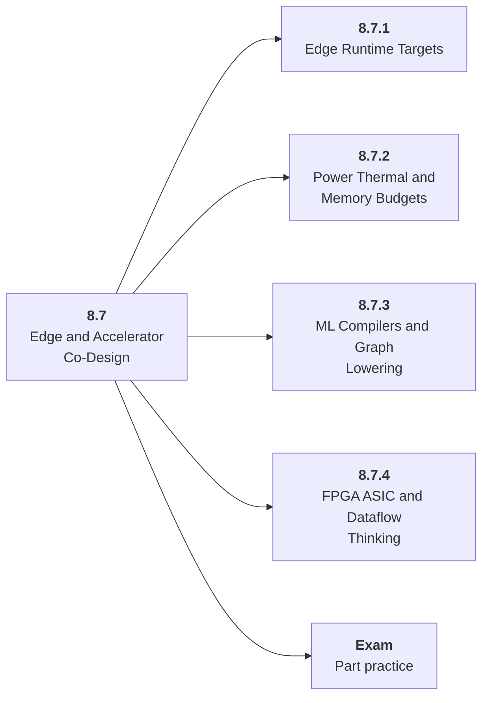

# 8.7 Edge and Accelerator Co-Design

## Role at Stage 8: Optimization and Hardware Acceleration

Connect workloads to Jetson, mobile NPUs, FPGA prototypes, compilers, and future chips. This part is one capability inside the stage. It should leave behind an artifact, measurements, and a short explanation of failure modes.

## Explanation

This part has 4 sub-parts because the topic needs that many learning units to feel natural. Some stages have more parts and some have fewer; the structure follows the topic, not a fixed template.

## Part Diagram

## Sub-Parts

| Sub-part folder | What it explains |
|---|---|
| [8.7.1 Edge Runtime Targets](<8.7.1 Edge Runtime Targets/index.md>) | Edge Runtime Targets is the working skill inside Edge and Accelerator Co-Design that helps you build the stage artifact, An inference benchmark and optimization report for an open-weight or hosted model workload, while collecting enough evidence to trust the result. |
| [8.7.2 Power Thermal and Memory Budgets](<8.7.2 Power Thermal and Memory Budgets/index.md>) | Power Thermal and Memory Budgets is the working skill inside Edge and Accelerator Co-Design that helps you build the stage artifact, An inference benchmark and optimization report for an open-weight or hosted model workload, while collecting enough evidence to trust the result. |
| [8.7.3 ML Compilers and Graph Lowering](<8.7.3 ML Compilers and Graph Lowering/index.md>) | ML Compilers and Graph Lowering is the working skill inside Edge and Accelerator Co-Design that helps you build the stage artifact, An inference benchmark and optimization report for an open-weight or hosted model workload, while collecting enough evidence to trust the result. |
| [8.7.4 FPGA ASIC and Dataflow Thinking](<8.7.4 FPGA ASIC and Dataflow Thinking/index.md>) | FPGA ASIC and Dataflow Thinking is the working skill inside Edge and Accelerator Co-Design that helps you build the stage artifact, An inference benchmark and optimization report for an open-weight or hosted model workload, while collecting enough evidence to trust the result. |

## What a Person Who Masters This Part Can Do

- Explain how Edge and Accelerator Co-Design supports an inference benchmark and optimization report for an open-weight or hosted model workload..
- Build and inspect this artifact: Create an edge deployment or accelerator workload contract.
- Measure progress with: Track power, thermals, memory, software support, and throughput.
- Debug at least one failure mode before moving to the next part.

## Build and Measure

**Build:** Create an edge deployment or accelerator workload contract.

**Measure:** Track power, thermals, memory, software support, and throughput.

## Tests

Take one 30-question exam after studying this part. It opens in a new browser tab so the study page stays available.

  <a href="test/exam.html" target="_blank" rel="noopener">Open Part Exam</a>

## Back to Stage

Return to [Stage 8: Optimization and Hardware Acceleration](<../index.md>).
