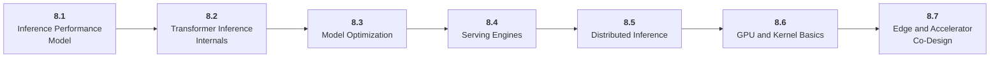

# Stage 8: Optimization and Hardware Acceleration

8 Make inference faster, cheaper, and more predictable.

## Goal

Understand inference performance, model optimization, serving engines, distributed inference, GPU basics, edge deployment, and accelerator tradeoffs.

## Roadmap to Master This Stage

1. Read the stage goal and diagram before opening the parts.
2. Move through the parts in order unless you can already pass the exit criteria.
3. Study each sub-part folder: overview, deep dive, and examples/practice.
4. Build the stage artifact in small slices and measure the listed metrics.
5. Use the part exam after each part, or open the global Exam tab to test across the roadmap.

## Stage Structure Diagram

## Parts

| Part | Simple explanation | Build focus |
|---|---|---|
| [8.1 Inference Performance Model](<8.1 Inference Performance Model/index.md>) | Use the measurement vocabulary and workload model behind optimization. | Benchmark varied prompt, output, and batch shapes. |
| [8.2 Transformer Inference Internals](<8.2 Transformer Inference Internals/index.md>) | Connect transformer computation to memory bandwidth, attention, cache layout, and sampling. | Trace one decode step for a small model. |
| [8.3 Model Optimization](<8.3 Model Optimization/index.md>) | Change or approximate computation while measuring quality risk. | Compare baseline and optimized model variants. |
| [8.4 Serving Engines](<8.4 Serving Engines/index.md>) | Understand how runtimes schedule, batch, stream, and manage model memory. | Serve a model or design a serving plan. |
| [8.5 Distributed Inference](<8.5 Distributed Inference/index.md>) | Scale inference across replicas or devices when one process is not enough. | Design a multi-GPU serving plan. |
| [8.6 GPU and Kernel Basics](<8.6 GPU and Kernel Basics/index.md>) | Build the hardware intuition needed to read profiles and understand bottlenecks. | Profile a simple GPU workload. |
| [8.7 Edge and Accelerator Co-Design](<8.7 Edge and Accelerator Co-Design/index.md>) | Connect workloads to Jetson, mobile NPUs, FPGA prototypes, compilers, and future chips. | Create an edge deployment or accelerator workload contract. |

## Sub-Part Map

| Part | Sub-part | Why it matters |
|---|---|---|
| 8.1 | [8.1.1 Latency Throughput and Cost Metrics](<8.1 Inference Performance Model/8.1.1 Latency Throughput and Cost Metrics/index.md>) | Latency Throughput and Cost Metrics is the working skill inside Inference Performance Model that helps you build the stage artifact, An inference benchmark and optimization report for an open-weight or hosted model workload, while collecting enough evidence to trust the result. |
| 8.1 | [8.1.2 Prefill Decode and KV Cache](<8.1 Inference Performance Model/8.1.2 Prefill Decode and KV Cache/index.md>) | Prefill Decode and KV Cache is the working skill inside Inference Performance Model that helps you build the stage artifact, An inference benchmark and optimization report for an open-weight or hosted model workload, while collecting enough evidence to trust the result. |
| 8.1 | [8.1.3 Batch Shape and Concurrency](<8.1 Inference Performance Model/8.1.3 Batch Shape and Concurrency/index.md>) | Batch Shape and Concurrency is the working skill inside Inference Performance Model that helps you build the stage artifact, An inference benchmark and optimization report for an open-weight or hosted model workload, while collecting enough evidence to trust the result. |
| 8.1 | [8.1.4 Benchmark Design](<8.1 Inference Performance Model/8.1.4 Benchmark Design/index.md>) | Benchmark Design is the working skill inside Inference Performance Model that helps you build the stage artifact, An inference benchmark and optimization report for an open-weight or hosted model workload, while collecting enough evidence to trust the result. |
| 8.2 | [8.2.1 Weight Memory and Activations](<8.2 Transformer Inference Internals/8.2.1 Weight Memory and Activations/index.md>) | Weight Memory and Activations is the working skill inside Transformer Inference Internals that helps you build the stage artifact, An inference benchmark and optimization report for an open-weight or hosted model workload, while collecting enough evidence to trust the result. |
| 8.2 | [8.2.2 Attention and KV Cache Layout](<8.2 Transformer Inference Internals/8.2.2 Attention and KV Cache Layout/index.md>) | Attention and KV Cache Layout is the working skill inside Transformer Inference Internals that helps you build the stage artifact, An inference benchmark and optimization report for an open-weight or hosted model workload, while collecting enough evidence to trust the result. |
| 8.2 | [8.2.3 GEMM GEMV and MLP Blocks](<8.2 Transformer Inference Internals/8.2.3 GEMM GEMV and MLP Blocks/index.md>) | GEMM GEMV and MLP Blocks is the working skill inside Transformer Inference Internals that helps you build the stage artifact, An inference benchmark and optimization report for an open-weight or hosted model workload, while collecting enough evidence to trust the result. |
| 8.2 | [8.2.4 Sampling Hot Path](<8.2 Transformer Inference Internals/8.2.4 Sampling Hot Path/index.md>) | Sampling Hot Path is the working skill inside Transformer Inference Internals that helps you build the stage artifact, An inference benchmark and optimization report for an open-weight or hosted model workload, while collecting enough evidence to trust the result. |
| 8.3 | [8.3.1 Quantization Formats](<8.3 Model Optimization/8.3.1 Quantization Formats/index.md>) | Quantization Formats is the working skill inside Model Optimization that helps you build the stage artifact, An inference benchmark and optimization report for an open-weight or hosted model workload, while collecting enough evidence to trust the result. |
| 8.3 | [8.3.2 Calibration and Quality Checks](<8.3 Model Optimization/8.3.2 Calibration and Quality Checks/index.md>) | Calibration and Quality Checks is the working skill inside Model Optimization that helps you build the stage artifact, An inference benchmark and optimization report for an open-weight or hosted model workload, while collecting enough evidence to trust the result. |
| 8.3 | [8.3.3 Distillation and Pruning](<8.3 Model Optimization/8.3.3 Distillation and Pruning/index.md>) | Distillation and Pruning is the working skill inside Model Optimization that helps you build the stage artifact, An inference benchmark and optimization report for an open-weight or hosted model workload, while collecting enough evidence to trust the result. |
| 8.3 | [8.3.4 Speculative Decoding](<8.3 Model Optimization/8.3.4 Speculative Decoding/index.md>) | Speculative Decoding is the working skill inside Model Optimization that helps you build the stage artifact, An inference benchmark and optimization report for an open-weight or hosted model workload, while collecting enough evidence to trust the result. |
| 8.4 | [8.4.1 vLLM SGLang TGI and TensorRT LLM](<8.4 Serving Engines/8.4.1 vLLM SGLang TGI and TensorRT LLM/index.md>) | vLLM SGLang TGI and TensorRT LLM is the working skill inside Serving Engines that helps you build the stage artifact, An inference benchmark and optimization report for an open-weight or hosted model workload, while collecting enough evidence to trust the result. |
| 8.4 | [8.4.2 Continuous Batching](<8.4 Serving Engines/8.4.2 Continuous Batching/index.md>) | Continuous Batching is the working skill inside Serving Engines that helps you build the stage artifact, An inference benchmark and optimization report for an open-weight or hosted model workload, while collecting enough evidence to trust the result. |
| 8.4 | [8.4.3 Paged Attention](<8.4 Serving Engines/8.4.3 Paged Attention/index.md>) | Paged Attention is the working skill inside Serving Engines that helps you build the stage artifact, An inference benchmark and optimization report for an open-weight or hosted model workload, while collecting enough evidence to trust the result. |
| 8.4 | [8.4.4 Streaming and Scheduler Policy](<8.4 Serving Engines/8.4.4 Streaming and Scheduler Policy/index.md>) | Streaming and Scheduler Policy is the working skill inside Serving Engines that helps you build the stage artifact, An inference benchmark and optimization report for an open-weight or hosted model workload, while collecting enough evidence to trust the result. |
| 8.5 | [8.5.1 Replica Parallelism](<8.5 Distributed Inference/8.5.1 Replica Parallelism/index.md>) | Replica Parallelism is the working skill inside Distributed Inference that helps you build the stage artifact, An inference benchmark and optimization report for an open-weight or hosted model workload, while collecting enough evidence to trust the result. |
| 8.5 | [8.5.2 Tensor Parallelism](<8.5 Distributed Inference/8.5.2 Tensor Parallelism/index.md>) | Tensor Parallelism is the working skill inside Distributed Inference that helps you build the stage artifact, An inference benchmark and optimization report for an open-weight or hosted model workload, while collecting enough evidence to trust the result. |
| 8.5 | [8.5.3 Pipeline and Expert Parallelism](<8.5 Distributed Inference/8.5.3 Pipeline and Expert Parallelism/index.md>) | Pipeline and Expert Parallelism is the working skill inside Distributed Inference that helps you build the stage artifact, An inference benchmark and optimization report for an open-weight or hosted model workload, while collecting enough evidence to trust the result. |
| 8.6 | [8.6.1 CUDA Threads Blocks and Warps](<8.6 GPU and Kernel Basics/8.6.1 CUDA Threads Blocks and Warps/index.md>) | CUDA Threads Blocks and Warps is the working skill inside GPU and Kernel Basics that helps you build the stage artifact, An inference benchmark and optimization report for an open-weight or hosted model workload, while collecting enough evidence to trust the result. |
| 8.6 | [8.6.2 Memory Hierarchy](<8.6 GPU and Kernel Basics/8.6.2 Memory Hierarchy/index.md>) | Memory Hierarchy is the working skill inside GPU and Kernel Basics that helps you build the stage artifact, An inference benchmark and optimization report for an open-weight or hosted model workload, while collecting enough evidence to trust the result. |
| 8.6 | [8.6.3 Tensor Cores and Mixed Precision](<8.6 GPU and Kernel Basics/8.6.3 Tensor Cores and Mixed Precision/index.md>) | Tensor Cores and Mixed Precision is the working skill inside GPU and Kernel Basics that helps you build the stage artifact, An inference benchmark and optimization report for an open-weight or hosted model workload, while collecting enough evidence to trust the result. |
| 8.6 | [8.6.4 Triton and Custom Kernels](<8.6 GPU and Kernel Basics/8.6.4 Triton and Custom Kernels/index.md>) | Triton and Custom Kernels is the working skill inside GPU and Kernel Basics that helps you build the stage artifact, An inference benchmark and optimization report for an open-weight or hosted model workload, while collecting enough evidence to trust the result. |
| 8.7 | [8.7.1 Edge Runtime Targets](<8.7 Edge and Accelerator Co-Design/8.7.1 Edge Runtime Targets/index.md>) | Edge Runtime Targets is the working skill inside Edge and Accelerator Co-Design that helps you build the stage artifact, An inference benchmark and optimization report for an open-weight or hosted model workload, while collecting enough evidence to trust the result. |
| 8.7 | [8.7.2 Power Thermal and Memory Budgets](<8.7 Edge and Accelerator Co-Design/8.7.2 Power Thermal and Memory Budgets/index.md>) | Power Thermal and Memory Budgets is the working skill inside Edge and Accelerator Co-Design that helps you build the stage artifact, An inference benchmark and optimization report for an open-weight or hosted model workload, while collecting enough evidence to trust the result. |
| 8.7 | [8.7.3 ML Compilers and Graph Lowering](<8.7 Edge and Accelerator Co-Design/8.7.3 ML Compilers and Graph Lowering/index.md>) | ML Compilers and Graph Lowering is the working skill inside Edge and Accelerator Co-Design that helps you build the stage artifact, An inference benchmark and optimization report for an open-weight or hosted model workload, while collecting enough evidence to trust the result. |
| 8.7 | [8.7.4 FPGA ASIC and Dataflow Thinking](<8.7 Edge and Accelerator Co-Design/8.7.4 FPGA ASIC and Dataflow Thinking/index.md>) | FPGA ASIC and Dataflow Thinking is the working skill inside Edge and Accelerator Co-Design that helps you build the stage artifact, An inference benchmark and optimization report for an open-weight or hosted model workload, while collecting enough evidence to trust the result. |

## Stage Artifact

An inference benchmark and optimization report for an open-weight or hosted model workload.

## What to Measure

- TTFT
- TPOT
- tokens per second
- p95 latency
- device memory
- cost per 1000 requests
- quality regression

## Exit Criteria

- explain prefill, decode, KV cache, batching, and memory math
- apply and evaluate optimization
- choose serving engines and targets
- reason about CPU, GPU, NPU, FPGA, edge, and cloud

## Navigation

Previous: [Stage 7: Model Infrastructure](<../7. Model Infrastructure/index.md>) | Next: [Stage 9: AI Security, Blockchain, and ZKML](<../9. Security, Blockchain, ZKML/index.md>)
