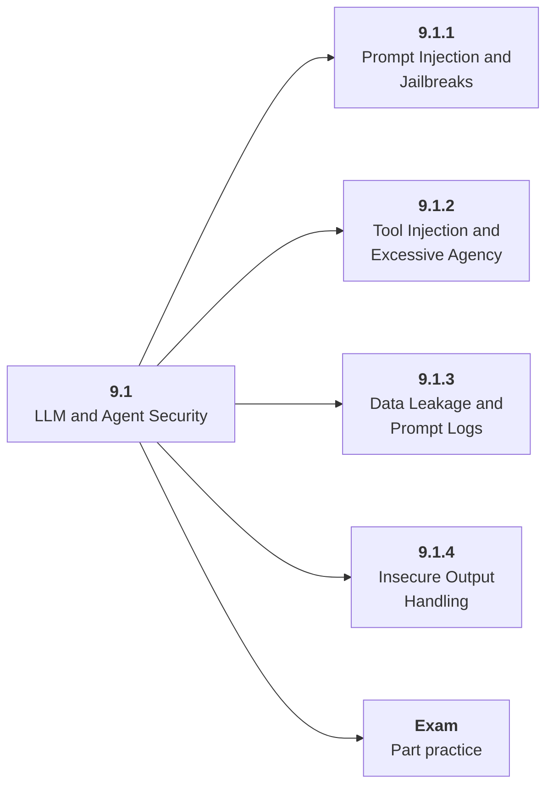

# 9.1 LLM and Agent Security

## Role at Stage 9: AI Security, Blockchain, and ZKML

Protect systems where models read untrusted content and call tools. This part is one capability inside the stage. It should leave behind an artifact, measurements, and a short explanation of failure modes.

## Explanation

This part has 4 sub-parts because the topic needs that many learning units to feel natural. Some stages have more parts and some have fewer; the structure follows the topic, not a fixed template.

## Part Diagram

## Sub-Parts

| Sub-part folder | What it explains |
|---|---|
| [9.1.1 Prompt Injection and Jailbreaks](<9.1.1 Prompt Injection and Jailbreaks/index.md>) | Prompt Injection and Jailbreaks is the working skill inside LLM and Agent Security that helps you build the stage artifact, A threat model, red-team report, smart contract security lab, and tiny ZKML or verifiable computation demo, while collecting enough evidence to trust the result. |
| [9.1.2 Tool Injection and Excessive Agency](<9.1.2 Tool Injection and Excessive Agency/index.md>) | Tool Injection and Excessive Agency is the working skill inside LLM and Agent Security that helps you build the stage artifact, A threat model, red-team report, smart contract security lab, and tiny ZKML or verifiable computation demo, while collecting enough evidence to trust the result. |
| [9.1.3 Data Leakage and Prompt Logs](<9.1.3 Data Leakage and Prompt Logs/index.md>) | Data Leakage and Prompt Logs is the working skill inside LLM and Agent Security that helps you build the stage artifact, A threat model, red-team report, smart contract security lab, and tiny ZKML or verifiable computation demo, while collecting enough evidence to trust the result. |
| [9.1.4 Insecure Output Handling](<9.1.4 Insecure Output Handling/index.md>) | Insecure Output Handling is the working skill inside LLM and Agent Security that helps you build the stage artifact, A threat model, red-team report, smart contract security lab, and tiny ZKML or verifiable computation demo, while collecting enough evidence to trust the result. |

## What a Person Who Masters This Part Can Do

- Explain how LLM and Agent Security supports a threat model, red-team report, smart contract security lab, and tiny zkml or verifiable computation demo..
- Build and inspect this artifact: Threat-model the Stage 6 agent.
- Measure progress with: Track attacks, blocked actions, exposure, and residual risks.
- Debug at least one failure mode before moving to the next part.

## Build and Measure

**Build:** Threat-model the Stage 6 agent.

**Measure:** Track attacks, blocked actions, exposure, and residual risks.

## Tests

Take one 30-question exam after studying this part. It opens in a new browser tab so the study page stays available.

  <a href="test/exam.html" target="_blank" rel="noopener">Open Part Exam</a>

## Back to Stage

Return to [Stage 9: AI Security, Blockchain, and ZKML](<../index.md>).
