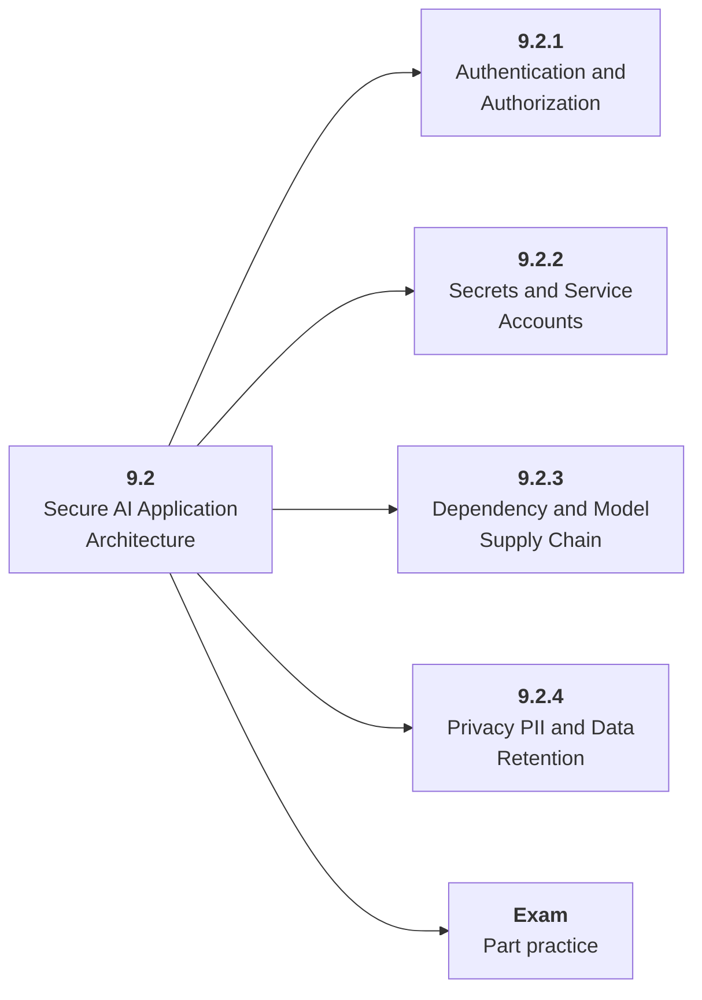

# 9.2 Secure AI Application Architecture

## Role at Stage 9: AI Security, Blockchain, and ZKML

Apply ordinary AppSec and privacy controls to AI services and data flows. This part is one capability inside the stage. It should leave behind an artifact, measurements, and a short explanation of failure modes.

## Explanation

This part has 4 sub-parts because the topic needs that many learning units to feel natural. Some stages have more parts and some have fewer; the structure follows the topic, not a fixed template.

## Part Diagram

## Sub-Parts

| Sub-part folder | What it explains |
|---|---|
| [9.2.1 Authentication and Authorization](<9.2.1 Authentication and Authorization/index.md>) | Authentication and Authorization is the working skill inside Secure AI Application Architecture that helps you build the stage artifact, A threat model, red-team report, smart contract security lab, and tiny ZKML or verifiable computation demo, while collecting enough evidence to trust the result. |
| [9.2.2 Secrets and Service Accounts](<9.2.2 Secrets and Service Accounts/index.md>) | Secrets and Service Accounts is the working skill inside Secure AI Application Architecture that helps you build the stage artifact, A threat model, red-team report, smart contract security lab, and tiny ZKML or verifiable computation demo, while collecting enough evidence to trust the result. |
| [9.2.3 Dependency and Model Supply Chain](<9.2.3 Dependency and Model Supply Chain/index.md>) | Dependency and Model Supply Chain is the working skill inside Secure AI Application Architecture that helps you build the stage artifact, A threat model, red-team report, smart contract security lab, and tiny ZKML or verifiable computation demo, while collecting enough evidence to trust the result. |
| [9.2.4 Privacy PII and Data Retention](<9.2.4 Privacy PII and Data Retention/index.md>) | Privacy PII and Data Retention is the working skill inside Secure AI Application Architecture that helps you build the stage artifact, A threat model, red-team report, smart contract security lab, and tiny ZKML or verifiable computation demo, while collecting enough evidence to trust the result. |

## What a Person Who Masters This Part Can Do

- Explain how Secure AI Application Architecture supports a threat model, red-team report, smart contract security lab, and tiny zkml or verifiable computation demo..
- Build and inspect this artifact: Create an AI risk register and controls plan.
- Measure progress with: Track severity, owner, mitigation, detection, and residual status.
- Debug at least one failure mode before moving to the next part.

## Build and Measure

**Build:** Create an AI risk register and controls plan.

**Measure:** Track severity, owner, mitigation, detection, and residual status.

## Tests

Take one 30-question exam after studying this part. It opens in a new browser tab so the study page stays available.

  <a href="test/exam.html" target="_blank" rel="noopener">Open Part Exam</a>

## Back to Stage

Return to [Stage 9: AI Security, Blockchain, and ZKML](<../index.md>).
