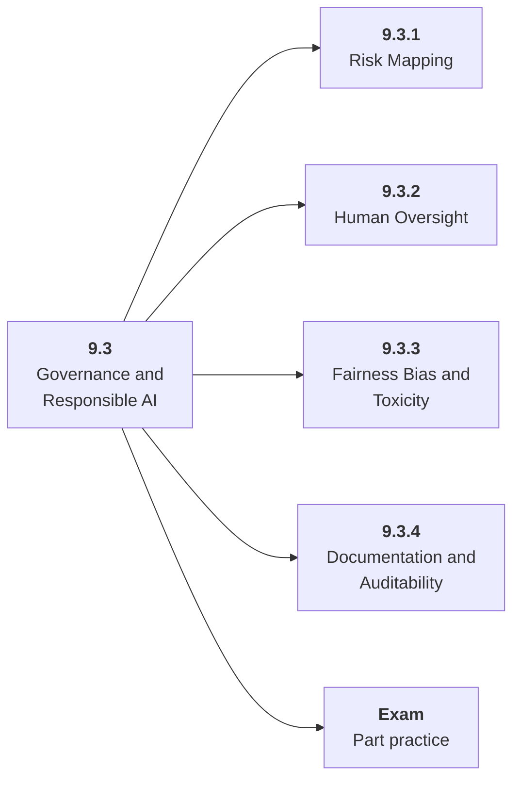

# 9.3 Governance and Responsible AI

## Role at Stage 9: AI Security, Blockchain, and ZKML

Map risks to controls, monitoring, human oversight, documentation, and review processes. This part is one capability inside the stage. It should leave behind an artifact, measurements, and a short explanation of failure modes.

## Explanation

This part has 4 sub-parts because the topic needs that many learning units to feel natural. Some stages have more parts and some have fewer; the structure follows the topic, not a fixed template.

## Part Diagram

## Sub-Parts

| Sub-part folder | What it explains |
|---|---|
| [9.3.1 Risk Mapping](<9.3.1 Risk Mapping/index.md>) | Risk Mapping is the working skill inside Governance and Responsible AI that helps you build the stage artifact, A threat model, red-team report, smart contract security lab, and tiny ZKML or verifiable computation demo, while collecting enough evidence to trust the result. |
| [9.3.2 Human Oversight](<9.3.2 Human Oversight/index.md>) | Human Oversight is the working skill inside Governance and Responsible AI that helps you build the stage artifact, A threat model, red-team report, smart contract security lab, and tiny ZKML or verifiable computation demo, while collecting enough evidence to trust the result. |
| [9.3.3 Fairness Bias and Toxicity](<9.3.3 Fairness Bias and Toxicity/index.md>) | Fairness Bias and Toxicity is the working skill inside Governance and Responsible AI that helps you build the stage artifact, A threat model, red-team report, smart contract security lab, and tiny ZKML or verifiable computation demo, while collecting enough evidence to trust the result. |
| [9.3.4 Documentation and Auditability](<9.3.4 Documentation and Auditability/index.md>) | Documentation and Auditability is the working skill inside Governance and Responsible AI that helps you build the stage artifact, A threat model, red-team report, smart contract security lab, and tiny ZKML or verifiable computation demo, while collecting enough evidence to trust the result. |

## What a Person Who Masters This Part Can Do

- Explain how Governance and Responsible AI supports a threat model, red-team report, smart contract security lab, and tiny zkml or verifiable computation demo..
- Build and inspect this artifact: Write a governance note for a high-impact AI feature.
- Measure progress with: Track risk treatment, oversight, monitoring, and documentation completeness.
- Debug at least one failure mode before moving to the next part.

## Build and Measure

**Build:** Write a governance note for a high-impact AI feature.

**Measure:** Track risk treatment, oversight, monitoring, and documentation completeness.

## Tests

Take one 30-question exam after studying this part. It opens in a new browser tab so the study page stays available.

  <a href="test/exam.html" target="_blank" rel="noopener">Open Part Exam</a>

## Back to Stage

Return to [Stage 9: AI Security, Blockchain, and ZKML](<../index.md>).
