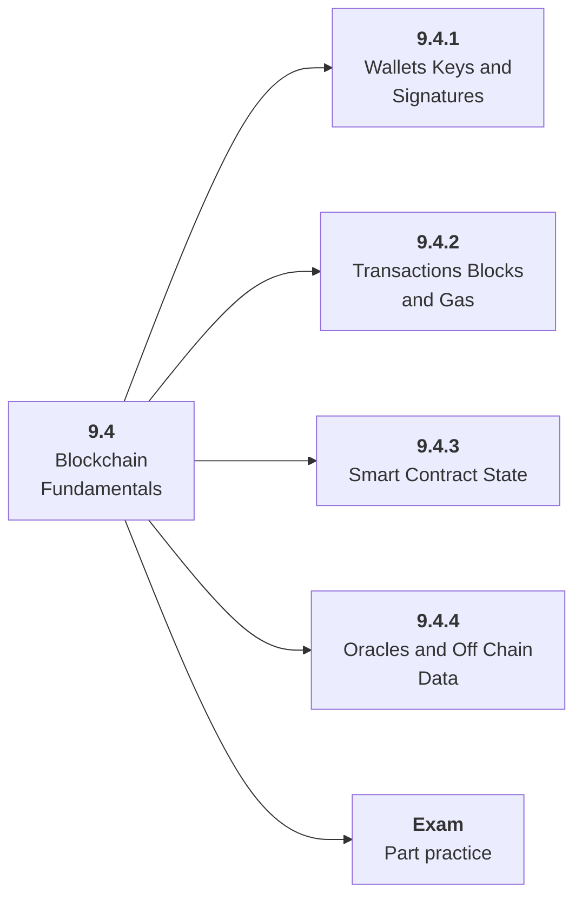

# 9.4 Blockchain Fundamentals

## Role at Stage 9: AI Security, Blockchain, and ZKML

Understand wallets, signatures, transactions, gas, state, and finality before AI systems touch chain state. This part is one capability inside the stage. It should leave behind an artifact, measurements, and a short explanation of failure modes.

## Explanation

This part has 4 sub-parts because the topic needs that many learning units to feel natural. Some stages have more parts and some have fewer; the structure follows the topic, not a fixed template.

## Part Diagram

## Sub-Parts

| Sub-part folder | What it explains |
|---|---|
| [9.4.1 Wallets Keys and Signatures](<9.4.1 Wallets Keys and Signatures/index.md>) | Wallets Keys and Signatures is the working skill inside Blockchain Fundamentals that helps you build the stage artifact, A threat model, red-team report, smart contract security lab, and tiny ZKML or verifiable computation demo, while collecting enough evidence to trust the result. |
| [9.4.2 Transactions Blocks and Gas](<9.4.2 Transactions Blocks and Gas/index.md>) | Transactions Blocks and Gas is the working skill inside Blockchain Fundamentals that helps you build the stage artifact, A threat model, red-team report, smart contract security lab, and tiny ZKML or verifiable computation demo, while collecting enough evidence to trust the result. |
| [9.4.3 Smart Contract State](<9.4.3 Smart Contract State/index.md>) | Smart Contract State is the working skill inside Blockchain Fundamentals that helps you build the stage artifact, A threat model, red-team report, smart contract security lab, and tiny ZKML or verifiable computation demo, while collecting enough evidence to trust the result. |
| [9.4.4 Oracles and Off Chain Data](<9.4.4 Oracles and Off Chain Data/index.md>) | Oracles and Off Chain Data is the working skill inside Blockchain Fundamentals that helps you build the stage artifact, A threat model, red-team report, smart contract security lab, and tiny ZKML or verifiable computation demo, while collecting enough evidence to trust the result. |

## What a Person Who Masters This Part Can Do

- Explain how Blockchain Fundamentals supports a threat model, red-team report, smart contract security lab, and tiny zkml or verifiable computation demo..
- Build and inspect this artifact: Trace a simple transaction workflow.
- Measure progress with: Track keys, permissions, transaction simulation, gas, and rollback assumptions.
- Debug at least one failure mode before moving to the next part.

## Build and Measure

**Build:** Trace a simple transaction workflow.

**Measure:** Track keys, permissions, transaction simulation, gas, and rollback assumptions.

## Tests

Take one 30-question exam after studying this part. It opens in a new browser tab so the study page stays available.

  <a href="test/exam.html" target="_blank" rel="noopener">Open Part Exam</a>

## Back to Stage

Return to [Stage 9: AI Security, Blockchain, and ZKML](<../index.md>).
