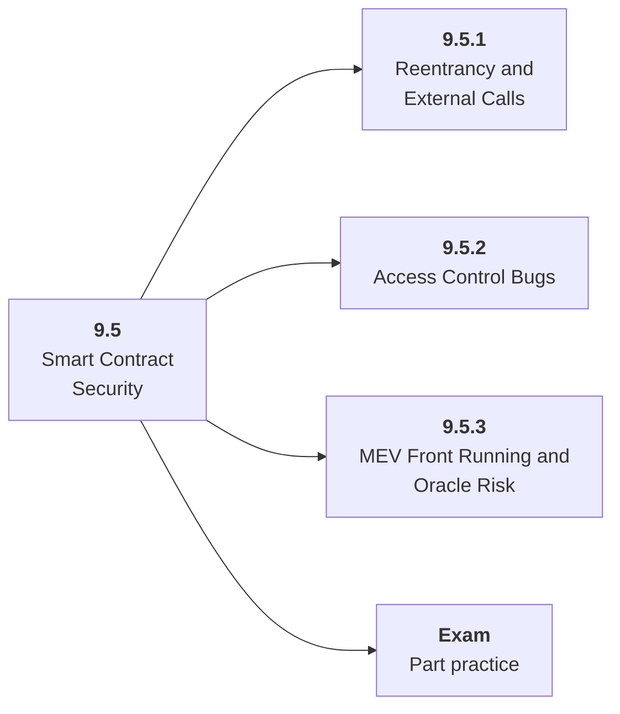

# 9.5 Smart Contract Security

## Role at Stage 9: AI Security, Blockchain, and ZKML

Recognize common contract vulnerabilities and design AI-to-chain permissions safely. This part is one capability inside the stage. It should leave behind an artifact, measurements, and a short explanation of failure modes.

## Explanation

This part has 3 sub-parts because the topic needs that many learning units to feel natural. Some stages have more parts and some have fewer; the structure follows the topic, not a fixed template.

## Part Diagram

## Sub-Parts

| Sub-part folder | What it explains |
|---|---|
| [9.5.1 Reentrancy and External Calls](<9.5.1 Reentrancy and External Calls/index.md>) | Reentrancy and External Calls is the working skill inside Smart Contract Security that helps you build the stage artifact, A threat model, red-team report, smart contract security lab, and tiny ZKML or verifiable computation demo, while collecting enough evidence to trust the result. |
| [9.5.2 Access Control Bugs](<9.5.2 Access Control Bugs/index.md>) | Access Control Bugs is the working skill inside Smart Contract Security that helps you build the stage artifact, A threat model, red-team report, smart contract security lab, and tiny ZKML or verifiable computation demo, while collecting enough evidence to trust the result. |
| [9.5.3 MEV Front Running and Oracle Risk](<9.5.3 MEV Front Running and Oracle Risk/index.md>) | MEV Front Running and Oracle Risk is the working skill inside Smart Contract Security that helps you build the stage artifact, A threat model, red-team report, smart contract security lab, and tiny ZKML or verifiable computation demo, while collecting enough evidence to trust the result. |

## What a Person Who Masters This Part Can Do

- Explain how Smart Contract Security supports a threat model, red-team report, smart contract security lab, and tiny zkml or verifiable computation demo..
- Build and inspect this artifact: Create vulnerable contracts, exploits, and fixes.
- Measure progress with: Track vulnerabilities reproduced, tests added, gas impact, and residual risk.
- Debug at least one failure mode before moving to the next part.

## Build and Measure

**Build:** Create vulnerable contracts, exploits, and fixes.

**Measure:** Track vulnerabilities reproduced, tests added, gas impact, and residual risk.

## Tests

Take one 30-question exam after studying this part. It opens in a new browser tab so the study page stays available.

  <a href="test/exam.html" target="_blank" rel="noopener">Open Part Exam</a>

## Back to Stage

Return to [Stage 9: AI Security, Blockchain, and ZKML](<../index.md>).
