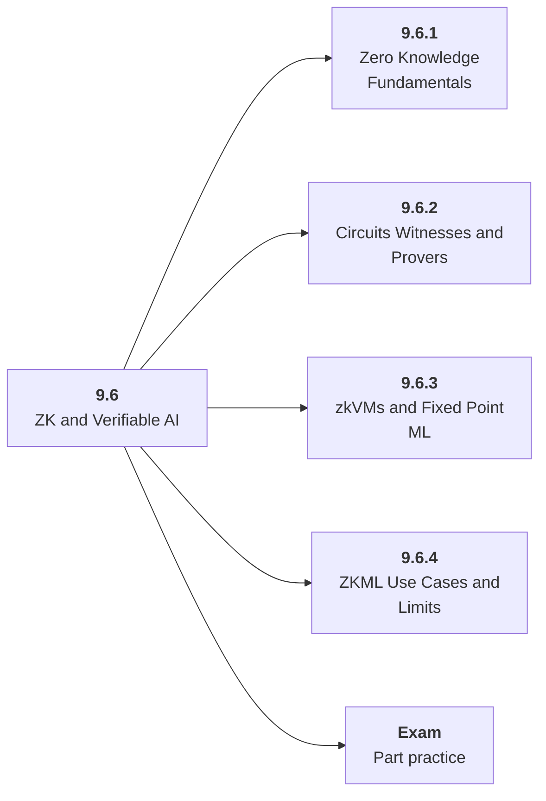

# 9.6 ZK and Verifiable AI

## Role at Stage 9: AI Security, Blockchain, and ZKML

Use cryptographic verification for trust, privacy, and constrained model claims. This part is one capability inside the stage. It should leave behind an artifact, measurements, and a short explanation of failure modes.

## Explanation

This part has 4 sub-parts because the topic needs that many learning units to feel natural. Some stages have more parts and some have fewer; the structure follows the topic, not a fixed template.

## Part Diagram

## Sub-Parts

| Sub-part folder | What it explains |
|---|---|
| [9.6.1 Zero Knowledge Fundamentals](<9.6.1 Zero Knowledge Fundamentals/index.md>) | Zero Knowledge Fundamentals is the working skill inside ZK and Verifiable AI that helps you build the stage artifact, A threat model, red-team report, smart contract security lab, and tiny ZKML or verifiable computation demo, while collecting enough evidence to trust the result. |
| [9.6.2 Circuits Witnesses and Provers](<9.6.2 Circuits Witnesses and Provers/index.md>) | Circuits Witnesses and Provers is the working skill inside ZK and Verifiable AI that helps you build the stage artifact, A threat model, red-team report, smart contract security lab, and tiny ZKML or verifiable computation demo, while collecting enough evidence to trust the result. |
| [9.6.3 zkVMs and Fixed Point ML](<9.6.3 zkVMs and Fixed Point ML/index.md>) | zkVMs and Fixed Point ML is the working skill inside ZK and Verifiable AI that helps you build the stage artifact, A threat model, red-team report, smart contract security lab, and tiny ZKML or verifiable computation demo, while collecting enough evidence to trust the result. |
| [9.6.4 ZKML Use Cases and Limits](<9.6.4 ZKML Use Cases and Limits/index.md>) | ZKML Use Cases and Limits is the working skill inside ZK and Verifiable AI that helps you build the stage artifact, A threat model, red-team report, smart contract security lab, and tiny ZKML or verifiable computation demo, while collecting enough evidence to trust the result. |

## What a Person Who Masters This Part Can Do

- Explain how ZK and Verifiable AI supports a threat model, red-team report, smart contract security lab, and tiny zkml or verifiable computation demo..
- Build and inspect this artifact: Prove a tiny model-related computation.
- Measure progress with: Track circuit size, proving time, verification time, precision loss, and model limits.
- Debug at least one failure mode before moving to the next part.

## Build and Measure

**Build:** Prove a tiny model-related computation.

**Measure:** Track circuit size, proving time, verification time, precision loss, and model limits.

## Tests

Take one 30-question exam after studying this part. It opens in a new browser tab so the study page stays available.

  <a href="test/exam.html" target="_blank" rel="noopener">Open Part Exam</a>

## Back to Stage

Return to [Stage 9: AI Security, Blockchain, and ZKML](<../index.md>).
