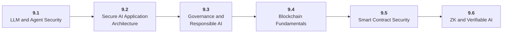

# Stage 9: AI Security, Blockchain, and ZKML

9 Secure, govern, and verify AI-enabled systems.

## Goal

Learn AI and agent security, application security, governance, blockchain fundamentals, smart contract risk, zero-knowledge concepts, and practical ZKML limits.

## Roadmap to Master This Stage

1. Read the stage goal and diagram before opening the parts.
2. Move through the parts in order unless you can already pass the exit criteria.
3. Study each sub-part folder: overview, deep dive, and examples/practice.
4. Build the stage artifact in small slices and measure the listed metrics.
5. Use the part exam after each part, or open the global Exam tab to test across the roadmap.

## Stage Structure Diagram

## Parts

| Part | Simple explanation | Build focus |
|---|---|---|
| [9.1 LLM and Agent Security](<9.1 LLM and Agent Security/index.md>) | Protect systems where models read untrusted content and call tools. | Threat-model the Stage 6 agent. |
| [9.2 Secure AI Application Architecture](<9.2 Secure AI Application Architecture/index.md>) | Apply ordinary AppSec and privacy controls to AI services and data flows. | Create an AI risk register and controls plan. |
| [9.3 Governance and Responsible AI](<9.3 Governance and Responsible AI/index.md>) | Map risks to controls, monitoring, human oversight, documentation, and review processes. | Write a governance note for a high-impact AI feature. |
| [9.4 Blockchain Fundamentals](<9.4 Blockchain Fundamentals/index.md>) | Understand wallets, signatures, transactions, gas, state, and finality before AI systems touch chain state. | Trace a simple transaction workflow. |
| [9.5 Smart Contract Security](<9.5 Smart Contract Security/index.md>) | Recognize common contract vulnerabilities and design AI-to-chain permissions safely. | Create vulnerable contracts, exploits, and fixes. |
| [9.6 ZK and Verifiable AI](<9.6 ZK and Verifiable AI/index.md>) | Use cryptographic verification for trust, privacy, and constrained model claims. | Prove a tiny model-related computation. |

## Sub-Part Map

| Part | Sub-part | Why it matters |
|---|---|---|
| 9.1 | [9.1.1 Prompt Injection and Jailbreaks](<9.1 LLM and Agent Security/9.1.1 Prompt Injection and Jailbreaks/index.md>) | Prompt Injection and Jailbreaks is the working skill inside LLM and Agent Security that helps you build the stage artifact, A threat model, red-team report, smart contract security lab, and tiny ZKML or verifiable computation demo, while collecting enough evidence to trust the result. |
| 9.1 | [9.1.2 Tool Injection and Excessive Agency](<9.1 LLM and Agent Security/9.1.2 Tool Injection and Excessive Agency/index.md>) | Tool Injection and Excessive Agency is the working skill inside LLM and Agent Security that helps you build the stage artifact, A threat model, red-team report, smart contract security lab, and tiny ZKML or verifiable computation demo, while collecting enough evidence to trust the result. |
| 9.1 | [9.1.3 Data Leakage and Prompt Logs](<9.1 LLM and Agent Security/9.1.3 Data Leakage and Prompt Logs/index.md>) | Data Leakage and Prompt Logs is the working skill inside LLM and Agent Security that helps you build the stage artifact, A threat model, red-team report, smart contract security lab, and tiny ZKML or verifiable computation demo, while collecting enough evidence to trust the result. |
| 9.1 | [9.1.4 Insecure Output Handling](<9.1 LLM and Agent Security/9.1.4 Insecure Output Handling/index.md>) | Insecure Output Handling is the working skill inside LLM and Agent Security that helps you build the stage artifact, A threat model, red-team report, smart contract security lab, and tiny ZKML or verifiable computation demo, while collecting enough evidence to trust the result. |
| 9.2 | [9.2.1 Authentication and Authorization](<9.2 Secure AI Application Architecture/9.2.1 Authentication and Authorization/index.md>) | Authentication and Authorization is the working skill inside Secure AI Application Architecture that helps you build the stage artifact, A threat model, red-team report, smart contract security lab, and tiny ZKML or verifiable computation demo, while collecting enough evidence to trust the result. |
| 9.2 | [9.2.2 Secrets and Service Accounts](<9.2 Secure AI Application Architecture/9.2.2 Secrets and Service Accounts/index.md>) | Secrets and Service Accounts is the working skill inside Secure AI Application Architecture that helps you build the stage artifact, A threat model, red-team report, smart contract security lab, and tiny ZKML or verifiable computation demo, while collecting enough evidence to trust the result. |
| 9.2 | [9.2.3 Dependency and Model Supply Chain](<9.2 Secure AI Application Architecture/9.2.3 Dependency and Model Supply Chain/index.md>) | Dependency and Model Supply Chain is the working skill inside Secure AI Application Architecture that helps you build the stage artifact, A threat model, red-team report, smart contract security lab, and tiny ZKML or verifiable computation demo, while collecting enough evidence to trust the result. |
| 9.2 | [9.2.4 Privacy PII and Data Retention](<9.2 Secure AI Application Architecture/9.2.4 Privacy PII and Data Retention/index.md>) | Privacy PII and Data Retention is the working skill inside Secure AI Application Architecture that helps you build the stage artifact, A threat model, red-team report, smart contract security lab, and tiny ZKML or verifiable computation demo, while collecting enough evidence to trust the result. |
| 9.3 | [9.3.1 Risk Mapping](<9.3 Governance and Responsible AI/9.3.1 Risk Mapping/index.md>) | Risk Mapping is the working skill inside Governance and Responsible AI that helps you build the stage artifact, A threat model, red-team report, smart contract security lab, and tiny ZKML or verifiable computation demo, while collecting enough evidence to trust the result. |
| 9.3 | [9.3.2 Human Oversight](<9.3 Governance and Responsible AI/9.3.2 Human Oversight/index.md>) | Human Oversight is the working skill inside Governance and Responsible AI that helps you build the stage artifact, A threat model, red-team report, smart contract security lab, and tiny ZKML or verifiable computation demo, while collecting enough evidence to trust the result. |
| 9.3 | [9.3.3 Fairness Bias and Toxicity](<9.3 Governance and Responsible AI/9.3.3 Fairness Bias and Toxicity/index.md>) | Fairness Bias and Toxicity is the working skill inside Governance and Responsible AI that helps you build the stage artifact, A threat model, red-team report, smart contract security lab, and tiny ZKML or verifiable computation demo, while collecting enough evidence to trust the result. |
| 9.3 | [9.3.4 Documentation and Auditability](<9.3 Governance and Responsible AI/9.3.4 Documentation and Auditability/index.md>) | Documentation and Auditability is the working skill inside Governance and Responsible AI that helps you build the stage artifact, A threat model, red-team report, smart contract security lab, and tiny ZKML or verifiable computation demo, while collecting enough evidence to trust the result. |
| 9.4 | [9.4.1 Wallets Keys and Signatures](<9.4 Blockchain Fundamentals/9.4.1 Wallets Keys and Signatures/index.md>) | Wallets Keys and Signatures is the working skill inside Blockchain Fundamentals that helps you build the stage artifact, A threat model, red-team report, smart contract security lab, and tiny ZKML or verifiable computation demo, while collecting enough evidence to trust the result. |
| 9.4 | [9.4.2 Transactions Blocks and Gas](<9.4 Blockchain Fundamentals/9.4.2 Transactions Blocks and Gas/index.md>) | Transactions Blocks and Gas is the working skill inside Blockchain Fundamentals that helps you build the stage artifact, A threat model, red-team report, smart contract security lab, and tiny ZKML or verifiable computation demo, while collecting enough evidence to trust the result. |
| 9.4 | [9.4.3 Smart Contract State](<9.4 Blockchain Fundamentals/9.4.3 Smart Contract State/index.md>) | Smart Contract State is the working skill inside Blockchain Fundamentals that helps you build the stage artifact, A threat model, red-team report, smart contract security lab, and tiny ZKML or verifiable computation demo, while collecting enough evidence to trust the result. |
| 9.4 | [9.4.4 Oracles and Off Chain Data](<9.4 Blockchain Fundamentals/9.4.4 Oracles and Off Chain Data/index.md>) | Oracles and Off Chain Data is the working skill inside Blockchain Fundamentals that helps you build the stage artifact, A threat model, red-team report, smart contract security lab, and tiny ZKML or verifiable computation demo, while collecting enough evidence to trust the result. |
| 9.5 | [9.5.1 Reentrancy and External Calls](<9.5 Smart Contract Security/9.5.1 Reentrancy and External Calls/index.md>) | Reentrancy and External Calls is the working skill inside Smart Contract Security that helps you build the stage artifact, A threat model, red-team report, smart contract security lab, and tiny ZKML or verifiable computation demo, while collecting enough evidence to trust the result. |
| 9.5 | [9.5.2 Access Control Bugs](<9.5 Smart Contract Security/9.5.2 Access Control Bugs/index.md>) | Access Control Bugs is the working skill inside Smart Contract Security that helps you build the stage artifact, A threat model, red-team report, smart contract security lab, and tiny ZKML or verifiable computation demo, while collecting enough evidence to trust the result. |
| 9.5 | [9.5.3 MEV Front Running and Oracle Risk](<9.5 Smart Contract Security/9.5.3 MEV Front Running and Oracle Risk/index.md>) | MEV Front Running and Oracle Risk is the working skill inside Smart Contract Security that helps you build the stage artifact, A threat model, red-team report, smart contract security lab, and tiny ZKML or verifiable computation demo, while collecting enough evidence to trust the result. |
| 9.6 | [9.6.1 Zero Knowledge Fundamentals](<9.6 ZK and Verifiable AI/9.6.1 Zero Knowledge Fundamentals/index.md>) | Zero Knowledge Fundamentals is the working skill inside ZK and Verifiable AI that helps you build the stage artifact, A threat model, red-team report, smart contract security lab, and tiny ZKML or verifiable computation demo, while collecting enough evidence to trust the result. |
| 9.6 | [9.6.2 Circuits Witnesses and Provers](<9.6 ZK and Verifiable AI/9.6.2 Circuits Witnesses and Provers/index.md>) | Circuits Witnesses and Provers is the working skill inside ZK and Verifiable AI that helps you build the stage artifact, A threat model, red-team report, smart contract security lab, and tiny ZKML or verifiable computation demo, while collecting enough evidence to trust the result. |
| 9.6 | [9.6.3 zkVMs and Fixed Point ML](<9.6 ZK and Verifiable AI/9.6.3 zkVMs and Fixed Point ML/index.md>) | zkVMs and Fixed Point ML is the working skill inside ZK and Verifiable AI that helps you build the stage artifact, A threat model, red-team report, smart contract security lab, and tiny ZKML or verifiable computation demo, while collecting enough evidence to trust the result. |
| 9.6 | [9.6.4 ZKML Use Cases and Limits](<9.6 ZK and Verifiable AI/9.6.4 ZKML Use Cases and Limits/index.md>) | ZKML Use Cases and Limits is the working skill inside ZK and Verifiable AI that helps you build the stage artifact, A threat model, red-team report, smart contract security lab, and tiny ZKML or verifiable computation demo, while collecting enough evidence to trust the result. |

## Stage Artifact

A threat model, red-team report, smart contract security lab, and tiny ZKML or verifiable computation demo.

## What to Measure

- security tests
- attack success before and after mitigation
- risk severity table
- proof generation time
- verifier time or gas
- model size limits

## Exit Criteria

- threat-model LLM and agent systems
- apply least privilege
- explain smart contract risks
- build or explain a tiny ZK proof and limits

## Navigation

Previous: [Stage 8: Optimization and Hardware Acceleration](<../8. Optimization and Hardware/index.md>) | Next: [Stage 10: Mastery](<../10. Mastery/index.md>)
